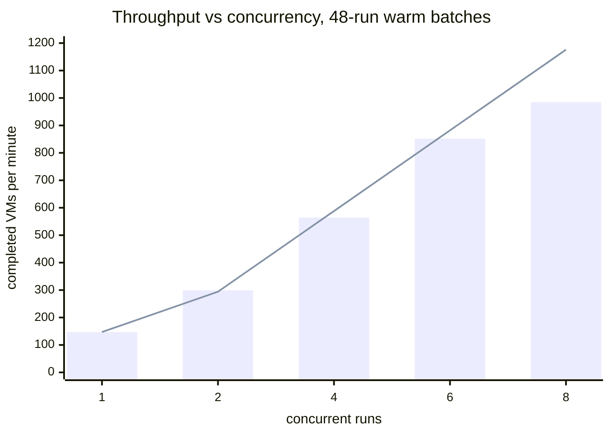

# Benchmarks

**Every `isopod run` boots a real, hardware-isolated Firecracker microVM, execs your
command over vsock, and destroys the VM — end to end in ~0.4 s. A warm-pool resume
brings a snapshotted VM back in ~49 ms (median).**

These are real measurements, not estimates. Each sample is one complete
`boot/resume → exec → destroy` cycle, and the timings are read straight out of
isopod's own JSON result (`total_ms`, `resume_ms`, `exec_ms`) — so a sample is the
genuine wall-clock cost of one disposable sandbox. Reproduce with
[`scripts/bench.py`](scripts/bench.py).

## Results

50 samples per category (5 discarded warm-up runs each), base-alpine, 1 vCPU / 512 MiB.

### End-to-end latency — `total_ms` (boot/resume → exec → destroy)

| Category | Path | min | **p50** | mean | p90 | p99 | max | seq. VMs/min |
|---|---|--:|--:|--:|--:|--:|--:|--:|
| **warm** — default networked run (repeat-call path) | warm resume | 374 | **402** | 405 | 430 | 450 | 450 | **148** |
| **cold** — first call / cache miss (networked) | cold boot | 414 | **438** | 442 | 466 | 498 | 498 | 136 |
| **no-net** — untrusted-code mode (`--no-network`) | cold boot | 389 | **439** | 441 | 462 | 475 | 475 | 136 |

*All times in milliseconds. "seq. VMs/min" = disposable microVMs booted, used, and
destroyed back-to-back in one minute (60000 / mean).*

### Warm-pool resume — `resume_ms` (snapshot → running guest)

The warm pool keeps a full-VM memory snapshot of a booted-idle guest and resumes it
into a free network slot instead of cold-booting the kernel:

| Metric | min | **p50** | mean | p90 | max |
|---|--:|--:|--:|--:|--:|
| `resume_ms` | 34 | **49** | 49 | 57 | 66 |

A resume is **~8× faster than a cold boot** of the guest, and re-applies the slot's IP
and re-syncs the guest clock over vsock afterwards (folded into the `warm` `total_ms`
above).

### Concurrency — throughput under parallel load

isopod claims independent network slots (8 on this host), so many disposable microVMs
can run at once. Here a batch of 48 warm runs is drained through a pool of *C* workers;
throughput is completed-runs-per-minute, and per-run latency shows whether each
individual sandbox slows down under load. Figures are the range observed across sweeps.

| Concurrency | Throughput (VMs/min) | Speedup vs 1 | Per-run p50 | Per-run p90 | Failures |
|--:|--:|--:|--:|--:|--|
| 1 | 146–148 | 1.0× | 406 | 422 | 0 |
| 2 | 296–302 | ~2.0× | 401 | 420 | 0 |
| 4 | 538–589 | ~3.8× | 396 | 429 | 0 in 3/4 trials, **9/48 once** |
| 6 | 830–873 | ~5.8× | 406 | 426 | **0 across all sweeps** |
| 8 | 892–1077 | ~6–7× | 412 | 518 | **0 in 2/4 trials, 13–14/48 in the others** |

Bars are the measured throughput (midpoint of each sweep's range); the line is
what perfectly linear scaling from the 1-way baseline would look like. The gap
between them opens at 4-way — the point where concurrency passes the host's
4 vCPUs:



**Throughput scales near-linearly to the host's core count** (~3.8× at 4-way on 4 vCPUs)
and keeps climbing to **~5.8× (~850 VMs/min) at 6-way with no observed failures** — and
individual runs barely slow down (p50 stays ~0.4 s; only the p90 tail grows once you
push past the core count). 8-way can peak past **1,000 VMs/min**, but not reliably (see
below).

**The honest ceiling — a slot-recycling race, not per-VM speed.** Under sustained
high-concurrency *churn* (rapidly recycling all 8 slots), a fraction of runs
intermittently fail with an identical error:

```
Firecracker API error: PUT /network-interfaces/eth0 -> 400:
Could not create the network device: Open tap device failed
```

i.e. a new run claims a just-freed slot and opens its tap device before the previous
VM's teardown has fully released it. It is **intermittent and load-dependent** (0/48 at
6-way across every sweep, but up to ~29% at 8-way in some), and it is **not** memory
exhaustion — ≥3.9 GiB of host RAM stayed free throughout. On this 4-vCPU host the
dependable operating point is **~4–6 concurrent**; the limit is host CPU plus this
tap-reuse race at full slot saturation. A host with more cores, RAM, and slots would
scale further. *(This race was found by this benchmark and is a real bug in 0.8.0, not
a tuning artifact.)*

## What the numbers mean

- **Sub-second, every time.** Even a cold boot — a fresh kernel, a fresh root
  filesystem, a fresh network — is done in well under half a second at p50, and the
  distribution is tight (warm p99 is 450 ms). This is what makes a *one action, one
  sandbox* agent cadence practical: you don't amortise a long-lived container, you
  spin up and throw away a whole VM per call.
- **~49 ms warm resume.** For the common case (repeated calls with the same base,
  network on, default scratch) the VM is resumed from a snapshot in tens of
  milliseconds, not cold-booted.
- **~150 disposable VMs a minute sequentially — ~850 at 6-way concurrency, on a
  laptop.** Single-threaded it sustains ~150 boot→exec→destroy cycles a minute; with
  parallelism it scales to ~5.8× (~850/min) before the host's 4 cores and a slot-reuse
  race become the ceiling (see Concurrency above). Bigger hosts scale further.

## Methodology & honest caveats

- **The command is trivial (`echo`) on purpose.** The benchmark measures isopod's own
  overhead — boot/resume, the vsock exec round-trip, and teardown — not the runtime of
  a workload. `exec_ms` for the trivial command is single-digit-to-low-hundreds of ms
  and is reported by the harness; `total_ms` is the number that matters and is what the
  tables above use. (Warm and cold split their time between boot and exec differently;
  `total_ms` is the honest end-to-end figure for both.)
- **This is a WSL2 host.** Measured under WSL2 (nested virtualization), which adds
  overhead versus bare metal — so these are, if anything, **conservative**; a native
  Linux host with `/dev/kvm` should be at least as fast.
- **Single host, single run.** Numbers are from one machine (below). They will vary
  with CPU, host kernel, memory pressure, and Firecracker/guest-kernel versions — any
  of which also invalidates the warm-pool key and forces a cold boot.
- **No container baseline.** A fair microVM-vs-container comparison needs a matched host
  and methodology; the only container runtime available here was Docker Desktop inside
  its own WSL2 VM, which would measure that plumbing rather than the boundary. Left as
  future work rather than shipped as a misleading chart.
- **Security is unchanged by speed.** These runs use the default public-only egress;
  private-network/metadata destinations are dropped regardless of how fast the VM boots
  (see [SECURITY.md](SECURITY.md)).

## Environment

| | |
|---|---|
| CPU | 13th Gen Intel(R) Core(TM) i7-13620H |
| Guest sizing | 1 vCPU / 512 MiB |
| Host kernel | 6.6.114.1-microsoft-standard-WSL2 |
| Guest kernel | vmlinux-6.18.36 (pinned, digest-verified) |
| VMM | Firecracker v1.16.1 (vendored build) |
| isopod | 0.8.0 |
| Base image | base-alpine (squashfs, read-only) |

## Reproduce

```bash
# prerequisites: `sudo isopod setup` has run once, warm pool is built
isopod warmpool build

# latency (warm / cold / no-network)
python3 scripts/bench.py --iters 50 --warmup 5 --json latency.json

# concurrency sweep (throughput + latency under parallel load)
python3 scripts/bench-concurrency.py --batch 48 --levels 1,2,4,6,8 --json concurrency.json
```

Both harnesses print a JSON summary to stdout and a human table to stderr.
`bench.py` takes `--iters` / `--warmup`; `bench-concurrency.py` takes `--batch` /
`--levels` to trade run time for stability and pick the concurrency points swept.
