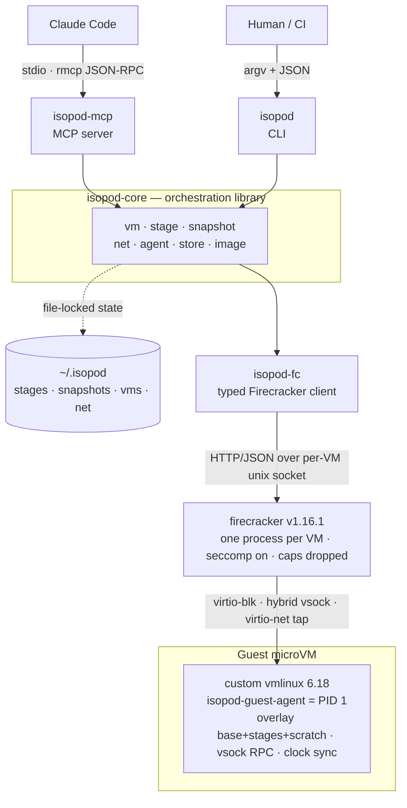
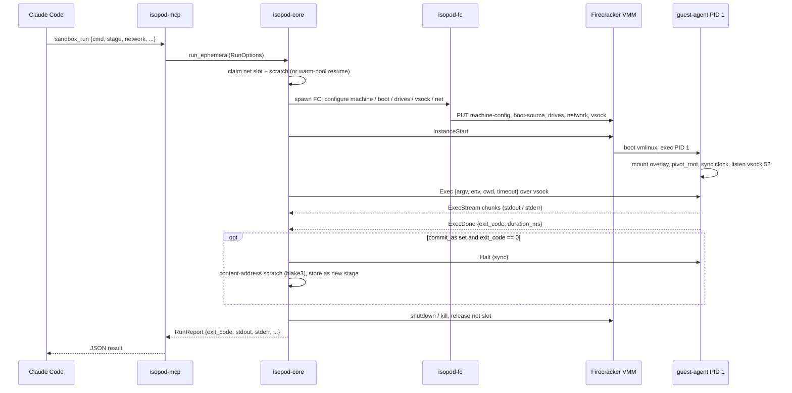
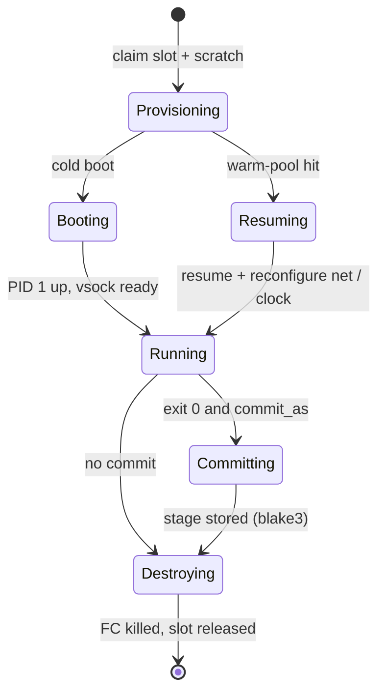
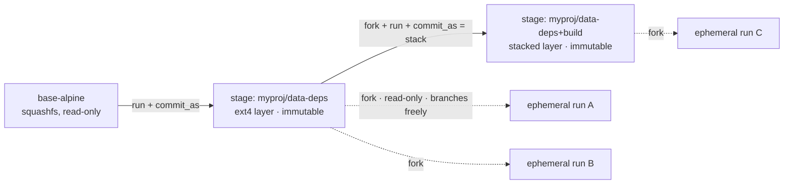
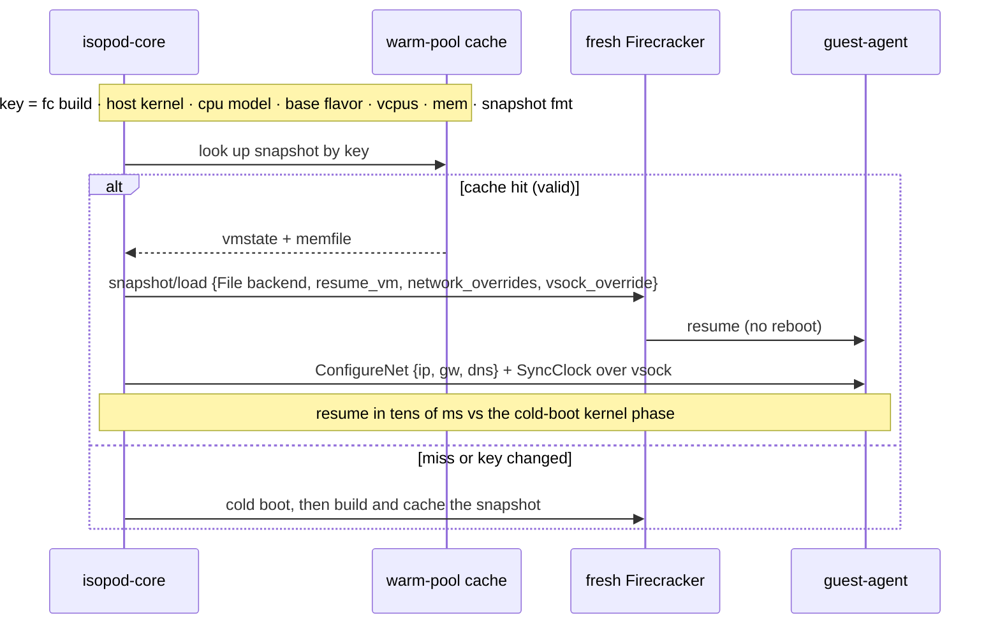

# isopod

[](https://github.com/me1iissa/isopod/actions/workflows/ci.yml)

**A Firecracker-microVM sandbox for Claude Code — run a command in a fast, hardware-isolated microVM that is destroyed after every call.**

isopod boots a real [Firecracker](https://firecracker-microvm.github.io/) microVM in roughly **0.4 s** (with a warm pool, resume is milliseconds), execs one command inside it over vsock, and tears the VM down. Nothing on the host filesystem is shared into the guest; isolation is the KVM hardware boundary plus Firecracker's seccomp filter, not a shared kernel. It is driven two ways over one shared core: as an **MCP server** for Claude Code, and as a **CLI** for humans and CI.

> **Status:** milestones M0–M6 complete (feasibility → boot-from-Rust → exec → stages → networking → MCP+skill → warm pool), followed by a security-hardening wave (default public-only guest egress, an opt-in rootless jail, bounded guest-controlled host sinks, digest-pinned guest kernels). Pre-1.0; `main` is the supported line. See [CHANGELOG.md](CHANGELOG.md) and [PLAN.md](PLAN.md).

---

## Quick start

Prerequisites: Linux x86_64 with `/dev/kvm` (your user in the `kvm` group), Rust via rustup, and `nftables iproute2 e2fsprogs squashfs-tools` plus a C toolchain. Full details, WSL2 notes, and troubleshooting: **[docs/getting-started.md](docs/getting-started.md)**.

```bash
# 1. Clone and build (toolchain is pinned by rust-toolchain.toml).
git clone https://github.com/me1iissa/isopod.git
cd isopod
git submodule update --init --recursive     # vendored Firecracker v1.16.1
cargo build --release

# 2. Build Firecracker and the guest images (all unprivileged).
./target/release/isopod dev build-fc        # ~/.isopod/bin/firecracker
./target/release/isopod image fetch-kernel  # pinned, digest-verified guest kernel
./target/release/isopod image build-all     # every guest rootfs image

# 3. One-time host networking — the only step that needs root.
#    (Skip it entirely if you will only ever run with --no-network.)
sudo ./target/release/isopod setup

# 4. Run something.
./target/release/isopod run --stage base --base base-alpine -- \
  python3 -c 'print("hello from a microVM")'
```

To drive it from **Claude Code**, register the MCP server and restart your session:

```bash
claude mcp add --scope local isopod -- "$PWD/target/release/isopod-mcp"
# then, inside Claude Code:  sandbox_run(cmd="echo hi")
```

---

## Why

Agents need somewhere fast and safe to run commands, build code, and execute untrusted or experimental workloads. Containers are heavy to set up, slow to tear down cleanly, and share the host kernel. Firecracker microVMs give hardware isolation with sub-second cold boots and single-digit-millisecond snapshot restores — the right fit for a **one action, one sandbox** agent cadence.

isopod is built around a single idea:

- **Sandboxes are ephemeral.** A microVM exists for one action, then dies. Every run is `boot → exec → destroy`.
- **Stages are persistent.** A run can leave behind a *stage* — a small copy-on-write disk layer capturing exactly what it changed. Later runs **fork** from a stage (start on top of it; the stage is never mutated) or **stack** a new layer. Stages are small, content-addressed, portable files. Nothing else survives a VM.

---

## Key concepts

### Ephemeral sandboxes vs. persistent stages

A `sandbox_run` (MCP) / `isopod run` (CLI) call is fully ephemeral: it boots a fresh VM, runs your command, captures output, and destroys everything. To keep state — installed packages, a built binary, a cloned repo — pass a commit label. On a clean exit (code 0) isopod freezes the sandbox's filesystem changes as an **immutable, content-addressed (blake3) stage**. Later runs **fork** that stage by name, id, or label, starting on top of it. Because forks never mutate the parent, you can branch a stage as many times as you like, concurrently, and it stays byte-identical.

```
run + commit  ──►  stage (immutable)  ──►  fork ──► run ──► commit  ──►  stacked stage
                          │
                          └──►  fork ──► ephemeral run  (parent untouched)
```

### Warm pool

A cold boot is fast (~0.4 s), but a warm resume is faster still. isopod keeps a **full-VM memory snapshot** of a booted-idle, network-less VM, keyed on the exact environment it must match. A fresh `sandbox_run` that qualifies (fresh base image, network on, no commit) **hot-resumes** that snapshot into a free network slot in tens of milliseconds instead of cold-booting, then re-applies the slot's IP and re-syncs the guest clock over vsock. Any change to the key (Firecracker build, host kernel, CPU model, base flavor, vCPUs, memory, snapshot format) silently invalidates the cache and falls back to a cold boot.

---

## Architecture

One binary core (`isopod-core`) sits behind two front ends and drives Firecracker through a hand-rolled typed client. All cross-invocation state lives under `~/.isopod`, file-locked so many sessions can share it.



**Crates** (see [CONTRIBUTING.md](CONTRIBUTING.md) for the full map):

| Crate | Package | Role |
|---|---|---|
| `crates/fc-client` | `isopod-fc` | Typed Firecracker management-API client (one HTTP client per VM over its unix socket, pre-boot/post-boot phase guard). Candidate standalone SDK. |
| `crates/core` | `isopod-core` | All orchestration logic: VM lifecycle, stage store, snapshot/warm-pool, networking, guest-agent RPC, on-disk store, image pipeline. |
| `crates/proto` | `isopod-proto` | The host↔guest vsock RPC contract (length-prefixed serde-JSON frames). |
| `crates/guest-agent` | `isopod-guest-agent` | Static musl binary that runs as PID 1 in the guest: mounts the overlay, pivots root, syncs the clock, serves exec/file RPC on vsock. |
| `crates/cli` | `isopod` | The `isopod` binary: `run`, `stage`, `vm`, `warmpool`, `setup`, `image`, `dev`. |
| `crates/mcp` | `isopod-mcp` | The rmcp 2.2 stdio MCP server for Claude Code. |
| `crates/jail` | `isopod-jail` | The optional rootless microjail that wraps each Firecracker process (user/pid namespaces, minimal chroot, per-VM cgroup caps). |

### The `sandbox_run` lifecycle



### VM lifecycle states



---

## Usage

### MCP tools

isopod exposes six tools. `sandbox_run` is the one you use 80% of the time; the rest inspect and prune the store.

| Tool | What it does |
|---|---|
| `sandbox_run` | Boot a VM, run `cmd` via `/bin/sh -c`, optionally commit the result as a stage, destroy the VM. Ephemeral unless `commit_as` is set and the command exits 0. |
| `stage_list` | List every committed stage (id, vanity name, label, parent, base, size, created). |
| `stage_info` | Full metadata plus the resolved layer chain for one stage. |
| `stage_rm` | Remove a stage (refused if another stage's chain still forks from it). |
| `vm_list` | Recent VM records — useful for finding a vanity name after the fact. |
| `vm_gc` | Reap orphaned Firecracker processes and prune old VM record directories. |

**Run an ephemeral snippet:**

```
sandbox_run(cmd="python3 -c 'print(2**10)'")
```

**Build an environment once, fork it forever:**

```
# 1. Install deps and commit the result (commits only on exit 0).
sandbox_run(cmd="pip install numpy pandas", commit_as="myproj/data-deps")

# 2. Every later run forks that stage instead of reinstalling — a few ms of disk setup.
sandbox_run(cmd="python3 -c 'import numpy; print(numpy.__version__)'",
            stage="myproj/data-deps")
```

**Run untrusted code with no network:**

```
sandbox_run(cmd="python3 suspicious_script.py", network=false)
```

Key `sandbox_run` parameters: `cmd` (required), `stage` (default `"base"` — a fresh toolchain VM), `base` (`base-alpine` with python/node/git/gcc, or `base-sqfs` minimal busybox), `network` (default `true`), `timeout_s` (default 120, an **outer wall-clock budget that includes boot**), `cwd`, `env`, `commit_as`, `stdin` / `stdin_file` (inline text vs. a host file for big payloads), `vcpus`, `mem_mib`, `scratch_mib` (per-VM sizing), and `copy_out` (stream guest files to host paths after the run — the binary-safe artifact channel). Full schema is self-describing in each tool. See [docs/mcp-usage.md](docs/mcp-usage.md).

### CLI

The same operations, one-shot argv + JSON:

```bash
# Boot from a base image, install deps, and commit a stage on success.
isopod run --stage base --base base-alpine --commit-as myproj/data-deps -- pip install requests

# Fork that stage by name (auto-uses the base it was built on).
isopod run --stage myproj/data-deps -- python3 -c 'import requests; print(requests.__version__)'

# Big builds: size the VM, feed stdin from a file, copy artifacts out.
isopod run --stage myproj/data-deps --vcpus 4 --mem-mib 3072 --scratch-mib 8192 \
  --copy-out /root/out/artifact:./artifact -- /bin/sh -c 'make -C /root/out'

# Inspect and prune the store.
isopod stage list
isopod stage info <id-or-name>
isopod vm gc --keep-last 20

# Warm pool.
isopod warmpool build
isopod warmpool list
```

Every subcommand prints exactly one JSON object to stdout (human-readable logs go to stderr), so the CLI, the MCP server, humans, and CI all drive the same core.

---

## Stage model

Stages are the persistence mechanism. Each is an immutable ext4 overlay layer, content-addressed by blake3 and stored under `~/.isopod/stages/<id>/` with a `meta.json` recording its parent chain, label, base flavor, and size. A running VM assembles a single overlay mount from the read-only base squashfs, the read-only stage layers, and a fresh writable scratch drive.



- **Commit** — after a clean run, the scratch layer is content-addressed and stored. Only exit code 0 commits, so a failed setup never silently produces a broken stage.
- **Fork** — start a VM on the same read-only lower chain plus a fresh scratch. A few milliseconds of disk setup, no copying; the lowers are shared by all concurrent forks and never mutated.
- **Stack** — `commit_as` again on top of a stage you forked from, adding a new layer rather than overwriting. A single base flavor is enforced per chain.

### Warm-pool resume



---

## Security

**Read [SECURITY.md](SECURITY.md) before running anything you do not trust.**

The short version:

- The security boundary is the Firecracker VMM + KVM, the host-side code that ingests guest-controlled bytes, and the tap/nftables network fabric — **not** the inside of the guest. Inside a guest, untrusted code runs as root by design; the guest is expendable.
- Firecracker runs **unprivileged** (kvm group) with its **seccomp filter on** and **all capabilities dropped**. Guest→host and guest→guest are blocked, the base image is read-only, and no host filesystem is shared into the guest.
- **Guest egress is public-only by default.** A networked guest reaches the internet but not the host's private network: RFC1918, CGNAT, and link-local/metadata destinations are dropped, with per-tap anti-spoofing. (LAN reachability is an explicit opt-in: `isopod setup --allow-lan-egress`.)
- An **optional rootless jail** (`ISOPOD_JAIL=1`) wraps each Firecracker in user/pid namespaces, a minimal chroot, and per-VM cgroup caps — a second isolation layer with no privileged host component. It is opt-in in this release; enable it (or keep the host single-tenant) before running mutually distrusting workloads.
- Guest-controlled host sinks are **bounded**: exec/serial logs are size-capped, every RPC the host waits on is time-bounded, and resource requests are validated before boot.
- For untrusted code, prefer **`--no-network` (CLI) / `network=false` (MCP)** — no NIC is attached at all; exec still works over vsock.

To report a vulnerability, use **GitHub's private vulnerability reporting** on this repository (Security → Advisories → *Report a vulnerability*). Please do not open a public issue for security bugs.

---

## Project status

All planned v1 milestones are complete, plus a post-v1 security-hardening wave:

| Milestone | Scope |
|---|---|
| **M0** | Feasibility spike — boot, snapshot round-trip, NAT egress, latency baselines. |
| **M1** | Boots from Rust — typed `isopod-fc` client, image pipeline, Firecracker built from vendored source. |
| **M2** | Exec — musl PID-1 guest agent, vsock exec, `isopod run`. |
| **M3** | Stages — squashfs base + guest overlay chains, content-addressed stage store, commit/fork/stack. |
| **M4** | Networking — `sudo isopod setup`, user-owned taps + nftables NAT, `--no-network`. |
| **M5** | MCP + skill — rmcp 2.2 stdio server, workflow skill, plugin packaging. |
| **M5.5** | Flexible per-VM vCPU / memory sizing. |
| **M6** | Warm pool — full-snapshot save/resume with post-resume net + clock reconfiguration over vsock. |
| **Hardening** | Public-only egress by default, rootless jail (`ISOPOD_JAIL=1`), bounded guest-controlled host sinks, digest-pinned guest kernel, streamed `copy_out`, `stdin_file`. |

Backlog (v2+): jail-on-by-default, a concurrent-VM memory governor + I/O rate limiters, exec/serial log retention auto-GC, UFFD lazy restore + snapshot compression, `stage flatten`, PTY exec, and host→guest port forwarding. See [PLAN.md](PLAN.md).

---

## Documentation

| Doc | What it covers |
|---|---|
| [docs/getting-started.md](docs/getting-started.md) | Full setup walk-through: prerequisites, build, images, networking, first runs, the jail, MCP registration, troubleshooting. |
| [docs/mcp-usage.md](docs/mcp-usage.md) | MCP server registration (local scope and plugin), the tool list, `sandbox_run` parameters and result shape. |
| [SECURITY.md](SECURITY.md) | The security model: threat model, what holds, the jail, known limitations, operator guidance. |
| [CONTRIBUTING.md](CONTRIBUTING.md) | Building, testing, crate map, coding conventions, versioning policy. |
| [CHANGELOG.md](CHANGELOG.md) | Release history. |
| [PLAN.md](PLAN.md) | The original architecture plan and milestone log (kept as an engineering record). |
| [docs/sandbox-build.md](docs/sandbox-build.md) | Building isopod inside its own sandboxes (dogfood recipe). |
| [docs/feasibility.md](docs/feasibility.md), [docs/m4-verify.md](docs/m4-verify.md), [docs/dogfood-findings.md](docs/dogfood-findings.md) | Engineering logs: the M0 spike results, M4 network verification, and the running dogfood findings ledger. |

---

## License

Licensed under the [Apache License, Version 2.0](LICENSE).
