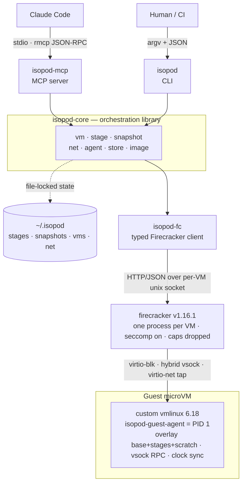
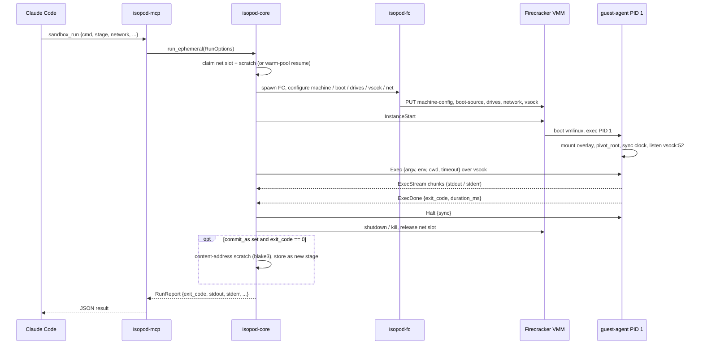
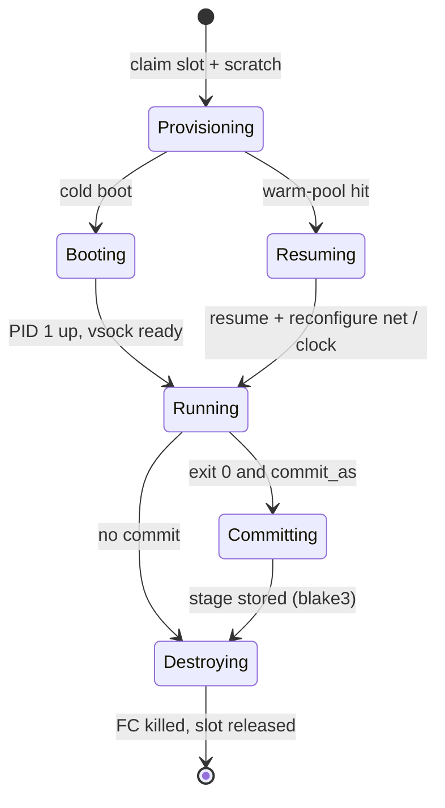
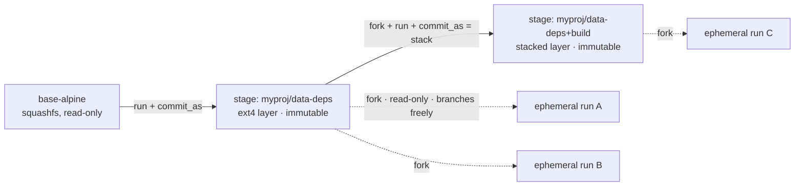
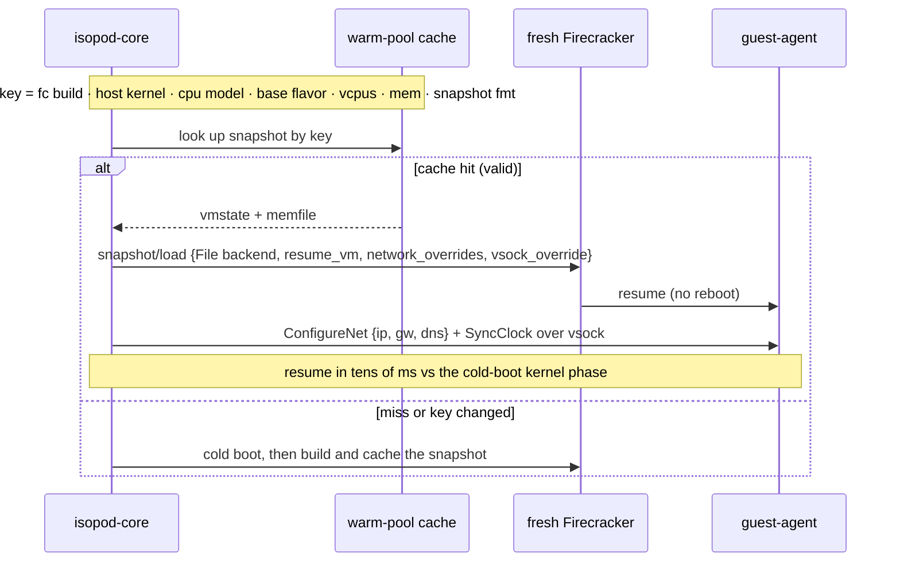

# isopod

[](https://github.com/me1iissa/isopod/actions/workflows/ci.yml)
[](https://github.com/me1iissa/isopod/actions/workflows/advisories.yml)

**Run untrusted code in a real microVM. Boots in ~0.4 s, destroyed after every call.**

isopod gives coding agents somewhere to run commands that isn't your machine. Each call boots a
[Firecracker](https://firecracker-microvm.github.io/) microVM, runs one command inside it, and throws
the VM away. Isolation is the KVM hardware boundary, not a shared kernel.

- **Fast enough to use per-action** — ~0.4 s cold, **~49 ms** from the warm pool ([measured](BENCHMARKS.md)).
- **Egress allowlists the guest cannot rewrite.** Name the hosts a run may reach; everything else fails
  closed. Enforced by nftables and a host-side broker, outside the sandbox.
- **A flight recorder for the network.** Every destination allowed and refused, every name resolved, with
  byte volumes — so you can watch a dependency try to phone home.
- **Nothing from your filesystem is shared in.** No bind mounts, no 9p. Files move only over explicit RPC.
- **Environments persist as stages,** not long-lived sandboxes. Commit what a run changed, fork it later;
  content-addressed and immutable.
- **One core, two front ends** — an **MCP server** for Claude Code and a **CLI** for humans and CI.
- **Auditable.** The whole enforcement path is a few files of Rust you can read, and the security claims
  ship with [the bypass attempts that test them](docs/egress-ledger.md).

📖 **[Documentation](https://me1iissa.github.io/isopod/)** · [Security model](SECURITY.md) · [Benchmarks](BENCHMARKS.md) · [Changelog](CHANGELOG.md)

```bash
sandbox_run(cmd="pip install requests", allow_hosts=["pypi.org", "*.pythonhosted.org"])
```

> Pre-1.0 and moving quickly; `main` is the supported line. Newest: host-declared
> credentials a run can spend but never read (0.10.0 — [docs](docs/credentials.md)),
> hardened in 0.11.0 after an adversarial review of the shipped code
> ([changelog](CHANGELOG.md)). **0.11.0 needs one `sudo isopod setup` on an existing
> host** — a filtered run now verifies the kernel's own forwarding guard and fails
> closed without it.

---

## Quick start

Prerequisites: Linux x86_64 with `/dev/kvm` (your user in the `kvm` group). Full details, WSL2 notes, and troubleshooting: **[docs/getting-started.md](docs/getting-started.md)**.

**Option A — install a release package.** Grab the `.deb`, `.rpm`, or tarball from the [releases page](https://github.com/me1iissa/isopod/releases); it ships the CLI, the MCP server, the jail helper, and prebuilt Firecracker + guest-agent binaries, so no Rust toolchain or source build is needed:

```bash
sudo apt install ./isopod_*_amd64.deb   # or: sudo dnf install ./isopod-*.x86_64.rpm

isopod image fetch-kernel   # pinned, digest-verified guest kernel
isopod image build-all      # guest rootfs images (unprivileged)
sudo isopod setup           # one-time host networking — the only root step
                            # (sudo drops ~/.local/bin from PATH: use an
                            #  explicit path, e.g. sudo ~/.local/bin/isopod setup)
isopod run --stage base --base base-alpine -- python3 -c 'print("hello from a microVM")'
```

**Option B — build from source** (needs Rust via rustup, `nftables iproute2 e2fsprogs squashfs-tools`, and a C toolchain):

```bash
git clone https://github.com/me1iissa/isopod.git
cd isopod
git submodule update --init --recursive     # vendored Firecracker v1.16.1
cargo build --release

./target/release/isopod dev build-fc        # build Firecracker -> ~/.isopod/bin
./target/release/isopod image fetch-kernel
./target/release/isopod image build-all
sudo ./target/release/isopod setup
./target/release/isopod run --stage base --base base-alpine -- \
  python3 -c 'print("hello from a microVM")'
```

To drive it from **Claude Code**, register the MCP server and restart your session:

```bash
claude mcp add --scope local isopod -- /usr/bin/isopod-mcp            # package install
claude mcp add --scope local isopod -- "$PWD/target/release/isopod-mcp"  # source checkout
# then, inside Claude Code:  sandbox_run(cmd="echo hi")
```

---

## Why

Agents need somewhere fast and safe to run commands, build code, and execute untrusted or experimental workloads. Containers are heavy to set up, slow to tear down cleanly, and share the host kernel. Firecracker microVMs give hardware isolation with sub-second cold boots and single-digit-millisecond snapshot restores — the right fit for a **one action, one sandbox** agent cadence.

isopod is built around a single idea:

- **Sandboxes are ephemeral.** A microVM exists for one action, then dies. Every run is `boot → exec → destroy`.
- **Stages are persistent.** A run can leave behind a *stage* — a small copy-on-write disk layer capturing exactly what it changed. Later runs **fork** from a stage (start on top of it; the stage is never mutated) or **stack** a new layer. Stages are small, content-addressed, portable files. Nothing else survives a VM.

---

## Key concepts

### Ephemeral sandboxes vs. persistent stages

A `sandbox_run` (MCP) / `isopod run` (CLI) call is fully ephemeral: it boots a fresh VM, runs your command, captures output, and destroys everything. To keep state — installed packages, a built binary, a cloned repo — pass a commit label. On a clean exit (code 0) isopod freezes the sandbox's filesystem changes as an **immutable, content-addressed (blake3) stage**. Later runs **fork** that stage by name, id, or label, starting on top of it. Because forks never mutate the parent, you can branch a stage as many times as you like, concurrently, and it stays byte-identical.

```
run + commit  ──►  stage (immutable)  ──►  fork ──► run ──► commit  ──►  stacked stage
                          │
                          └──►  fork ──► ephemeral run  (parent untouched)
```

A stage's layers belong to the *build* of the base image they were made over, so
each one records the content id that image's build sidecar reports, and a fork
refuses a base rebuilt since — checking every ancestor in the chain, naming both
ids and both ways out, rather than mounting silently over a root that no longer
matches. The image pack is timestamp-pinned, so a rebuild that changes nothing
keeps its id and refuses nothing; only a base whose *contents* moved retires the
stages on it. Stages committed before this existed fork unchecked.
[docs/getting-started.md](docs/getting-started.md#when-the-base-image-is-rebuilt)
has the diagram and the escape hatch.

### Warm pool

A cold boot is fast (~0.4 s), but a warm resume is faster still. isopod keeps a **full-VM memory snapshot** of a booted-idle, network-less VM, keyed on the exact environment it must match. A fresh `sandbox_run` that qualifies (fresh base image, network on, no commit, default scratch — the full rules are in [docs/getting-started.md](docs/getting-started.md)) **hot-resumes** that snapshot into a free network slot in tens of milliseconds instead of cold-booting, then re-applies the slot's IP and re-syncs the guest clock over vsock. Any change to the key (Firecracker build, host kernel, CPU model, base flavor, vCPUs, memory, snapshot format) silently invalidates the cache and falls back to a cold boot.

---

## Architecture

One binary core (`isopod-core`) sits behind two front ends and drives Firecracker through a hand-rolled typed client. All cross-invocation state lives under `~/.isopod`, file-locked so many sessions can share it.


```mermaid
flowchart TB
    CC["Claude Code"] -->|"stdio · rmcp JSON-RPC"| MCP["isopod-mcp<br/>MCP server"]
    HUMAN["Human / CI"] -->|"argv + JSON"| CLI["isopod<br/>CLI"]
    MCP --> CORE
    CLI --> CORE
    subgraph CORE_BOX["isopod-core — orchestration library"]
        CORE["vm · stage · snapshot<br/>net · agent · store · image"]
    end
    CORE -.->|"file-locked state"| STATE[("~/.isopod<br/>stages · snapshots · vms · net")]
    CORE --> FCLIB["isopod-fc<br/>typed Firecracker client"]
    FCLIB -->|"HTTP/JSON over per-VM unix socket"| FCVMM["firecracker v1.16.1<br/>one process per VM · seccomp on · caps dropped"]
    FCVMM -->|"virtio-blk · hybrid vsock · virtio-net tap"| GUEST
    subgraph GUEST_BOX["Guest microVM"]
        GUEST["custom vmlinux 6.18<br/>isopod-guest-agent = PID 1<br/>overlay base+stages+scratch · vsock RPC · clock sync"]
    end
```

**Crates** (see [CONTRIBUTING.md](CONTRIBUTING.md) for the full map):

| Crate | Package | Role |
|---|---|---|
| `crates/fc-client` | `isopod-fc` | Typed Firecracker management-API client (one HTTP client per VM over its unix socket, pre-boot/post-boot phase guard). Candidate standalone SDK. |
| `crates/core` | `isopod-core` | All orchestration logic: VM lifecycle, stage store, snapshot/warm-pool, networking, guest-agent RPC, on-disk store, image pipeline. |
| `crates/proto` | `isopod-proto` | The host↔guest vsock RPC contract (length-prefixed serde-JSON frames). |
| `crates/guest-agent` | `isopod-guest-agent` | Static musl binary that runs as PID 1 in the guest: mounts the overlay, pivots root, syncs the clock, serves exec/file RPC on vsock. |
| `crates/cli` | `isopod` | The `isopod` binary: `run`, `stage`, `vm`, `warmpool`, `setup`, `image`, `dev`. |
| `crates/mcp` | `isopod-mcp` | The rmcp 2.2 stdio MCP server for Claude Code. |
| `crates/jail` | `isopod-jail` | The optional rootless microjail that wraps each Firecracker process (user/pid namespaces, minimal chroot, per-VM cgroup caps). |
| `crates/oci-unpack` | `isopod-oci-unpack` | Confined extractor for OCI image layer tars (whiteouts, hard links, anti-bomb ceilings), plus an image-layout reader that digest-verifies every blob before it is used. Standalone: not yet wired into any command. |

### The `sandbox_run` lifecycle


```mermaid
sequenceDiagram
    participant CC as Claude Code
    participant MCP as isopod-mcp
    participant Core as isopod-core
    participant FcCli as isopod-fc
    participant FC as Firecracker VMM
    participant Guest as guest-agent PID 1

    CC->>MCP: sandbox_run {cmd, stage, network, ...}
    MCP->>Core: run_ephemeral(RunOptions)
    Core->>Core: claim net slot + scratch (or warm-pool resume)
    Core->>FcCli: spawn FC, configure machine / boot / drives / vsock / net
    FcCli->>FC: PUT machine-config, boot-source, drives, network, vsock
    Core->>FC: InstanceStart
    FC->>Guest: boot vmlinux, exec PID 1
    Guest->>Guest: mount overlay, pivot_root, sync clock, listen vsock:52
    Core->>Guest: Exec {argv, env, cwd, timeout} over vsock
    Guest-->>Core: ExecStream chunks (stdout / stderr)
    Guest-->>Core: ExecDone {exit_code, duration_ms}
    Core->>Guest: Halt {sync}
    Core->>FC: shutdown / kill, release net slot
    opt commit_as set and exit_code == 0
        Core->>Core: content-address scratch (blake3), store as new stage
    end
    Core-->>MCP: RunReport {exit_code, stdout, stderr, ...}
    MCP-->>CC: JSON result
```

### VM lifecycle states


```mermaid
stateDiagram-v2
    [*] --> Provisioning: claim slot + scratch
    Provisioning --> Booting: cold boot
    Provisioning --> Resuming: warm-pool hit
    Booting --> Running: PID 1 up, vsock ready
    Resuming --> Running: resume + reconfigure net / clock
    Running --> Committing: exit 0 and commit_as
    Running --> Destroying: no commit
    Committing --> Destroying: stage stored (blake3)
    Destroying --> [*]: FC killed, slot released
```

---

## Usage

### MCP tools

isopod exposes seven tools. `sandbox_run` is the one you use 80% of the time; the rest inspect and prune the store.

| Tool | What it does |
|---|---|
| `sandbox_run` | Boot a VM, run `cmd` via `/bin/sh -c`, optionally commit the result as a stage, destroy the VM. Ephemeral unless `commit_as` is set and the command exits 0. |
| `stage_list` | List every committed stage (id, vanity name, label, parent, base, size, created). |
| `stage_info` | Full metadata plus the resolved layer chain for one stage. |
| `stage_rm` | Remove a stage (refused if another stage's chain still forks from it). |
| `vm_list` | Recent VM records — useful for finding a vanity name after the fact. |
| `vm_gc` | Reap orphaned Firecracker processes and prune old VM record directories. |
| `image_list` | The base images `base` accepts: the built flavors, and every imported OCI image as `oci:<name>`, with whether each is present and stale. Read-only — importing and removing images stay on the CLI. |

**Run an ephemeral snippet:**

```
sandbox_run(cmd="python3 -c 'print(2**10)'")
```

**Build an environment once, fork it forever:**

```
# 1. Install deps and commit the result (commits only on exit 0).
sandbox_run(cmd="pip install numpy pandas", commit_as="myproj/data-deps")

# 2. Every later run forks that stage instead of reinstalling — a few ms of disk setup.
sandbox_run(cmd="python3 -c 'import numpy; print(numpy.__version__)'",
            stage="myproj/data-deps")
```

**Run untrusted code with no network:**

```
sandbox_run(cmd="python3 suspicious_script.py", network=false)
```

**Give a run one credential without giving it the token:**

```jsonc
// ~/.isopod/credentials.json, mode 0600 — declared once, on the host
"github": { "host": "api.github.com", "source": "env:GH_TOKEN",
            "allow": ["readonly"] }        // GET+HEAD only. Required field.
```

```
sandbox_run(cmd="wget -qO- $ISOPOD_CREDENTIAL_ENDPOINT/github/user", inject=["github"])
```

The run names the alias, never the secret. The broker builds each upstream
request **from its own parts** — the guest's `Host` and `Authorization` are
discarded, the target is normalised against origin-relocation tricks, redirects
are not followed, and the request goes out only if it matches a rule you wrote.
`POST /user/keys` under a `readonly` credential is not refused so much as
unexpressible. Naming a credential also switches the run to filtered egress, so
a token never arrives alongside an open network. See
[docs/credentials.md](docs/credentials.md).

**Or give it exactly one destination — default-deny egress, enforced on the host:**

```
sandbox_run(cmd="pip install requests",
            allow_hosts=["pypi.org", "*.pythonhosted.org"])
```

Anything else the run reaches for — another host, a raw IP, a DNS query to an
attacker's resolver — fails closed and is listed in the result's `egress`
record. Pass `allow_hosts=[]` to deny everything while still recording every
attempt, which is how you find out whether a dependency phones home.

Beyond `cmd`, `stage`, and `network`, `sandbox_run` takes `timeout_s` (an **outer wall-clock budget that includes boot**), `commit_as`, `cwd`/`env`, `stdin`/`stdin_file`, per-VM sizing (`vcpus`, `mem_mib`, `scratch_mib`), and `copy_out` for streaming artifacts back to the host. The full parameter and result tables live in [docs/mcp-usage.md](docs/mcp-usage.md); every tool's schema is also self-describing.

### CLI

The same operations, one-shot argv + JSON:

```bash
# Boot from a base image, install deps, and commit a stage on success.
isopod run --stage base --base base-alpine --commit-as myproj/data-deps -- pip install requests

# Fork that stage by name (auto-uses the base it was built on).
isopod run --stage myproj/data-deps -- python3 -c 'import requests; print(requests.__version__)'

# Default-deny egress: reach only these hosts, and record everything tried.
isopod run --allow-host pypi.org --allow-host '*.pythonhosted.org' \
  --stage base --base base-alpine -- pip install requests

# Find out what a dependency contacts, without letting any of it succeed.
isopod run --deny-egress --stage base --base base-alpine -- node index.js

# Big builds: size the VM, feed stdin from a file, copy artifacts out.
isopod run --stage myproj/data-deps --vcpus 4 --mem-mib 3072 --scratch-mib 8192 \
  --copy-out /root/out/artifact:./artifact -- /bin/sh -c 'make -C /root/out'

# Inspect and prune the store.
isopod stage list
isopod stage info <id-or-name>
isopod vm gc --keep-last 20

# Warm pool.
isopod warmpool build
isopod warmpool list

# Import a container image as a bootable base, then run on it.
isopod image import alpine:3.20
isopod run --stage base --base oci:alpine-3.20 -- /bin/sh -c 'cat /etc/alpine-release'
isopod image ls                        # built flavors and imported images, one list
isopod image rm alpine-3.20            # refused while a stage records it as its base
```

Every subcommand prints exactly one JSON object to stdout (human-readable logs go to stderr), so the CLI, the MCP server, humans, and CI all drive the same core.

### Where a run's time goes

`total_ms` is the whole run; the report now says where it went. Each phase
that used to be invisible has its own additive field — absent when the phase
did not happen, so existing consumers see the exact JSON they always did:

| Field | Phase | Present |
|---|---|---|
| `boot_ms` | `InstanceStart` → first agent ping (±50 ms poll quantum) | cold path |
| `resume_ms` | snapshot resume | warm path |
| `teardown_ms` | guest halt → VMM exit → log drain | every completed run |
| `copy_out_ms` | streaming `copy_out` files to the host | when files were copied |
| `snapshot_build_ms` | one-time warm-pool builder VM | when `snapshot_built` |
| `commit_ms` = `commit_hash_ms` + `commit_copy_ms` + scans | stage commit, split into the BLAKE3 content pass and the sparse layer copy | when a stage committed |

A real 509 ms cold `--no-network` run:


```mermaid
gantt
    dateFormat x
    axisFormat %L ms
    section run
    validate + resolve  :0, 21
    prepare_disk (mkfs) :22, 46
    boot fc_spawn       :46, 53
    boot api_config     :53, 110
    boot kernel_wait    :110, 320
    exec                :321, 368
    teardown            :368, 509
```

The same spans print live on stderr — every build, no feature flag, off by
default. `RUST_LOG=isopod=debug` enables them (stdout stays the single JSON
line):

```console
$ RUST_LOG=isopod=debug isopod run --no-network --stage base --base base-alpine -- true
DEBUG isopod.run:isopod.run.prepare_disk{isopod.disk.kind="scratch_mkfs"}: close time.busy=23.4ms
DEBUG isopod.run:isopod.run.boot:isopod.boot.kernel_wait: close time.idle=209ms
DEBUG isopod.run:isopod.run.boot{isopod.boot_ms=232}: close
DEBUG isopod.run:isopod.run.exec: close time.idle=46.4ms
DEBUG isopod.run:isopod.run.teardown: close time.idle=138ms
DEBUG isopod.run{isopod.vm_id="dev-d82b5562" isopod.run.path="cold" ...}: close
```

This is instrumentation, not telemetry: the spans go to your stderr and
nowhere else. There is no exporter, no network path, and no `opentelemetry`
dependency in any build; span attributes carry no command lines, no paths, no
stage names, and no exact output sizes (guest-influenced magnitudes appear
only as log2 buckets). What this does not buy: per-run CPU or guest memory
numbers, and `exec_ms` still folds vsock output streaming into compute time.

### Importing OCI images

`isopod image import` turns a container image into an isopod base — pulled from a registry, read from a local OCI layout, or read from a `docker save` tarball. Every blob is digest-verified before its bytes are used, and layers are unpacked by a confined extractor that never follows a symbolic link an earlier layer planted.

**isopod runs your image's filesystem, with isopod's init** — not "isopod runs your container". PID 1 is the guest agent, which does the overlay mounts, the pivot and the RPC, so an image's `ENTRYPOINT` can never be PID 1:

| Image config | What isopod does with it |
|---|---|
| `Env` | merged **under** the run's own environment — the run wins |
| `WorkingDir` | the run's default working directory |
| `Entrypoint` / `Cmd` | recorded, **never executed** |
| `User` | **ignored** — the agent execs as root |

An imported base is named `oci:<name>` wherever a base is named — `--base oci:alpine-3.20`, and the same over MCP. A stage committed on one records it, so a fork boots the base it was built on. The image's `Env` and `WorkingDir` become run **defaults**, applied under whatever the run itself sets, so a `python:3.12` base finds `python` on `PATH` without the caller restating it.

`isopod image ls` lists imported images beside the built flavors in one list — the same namespace `--base` takes — each with its origin, its size and the same staleness verdict a built image gets. `isopod image rm <name>` removes one, and is **refused while a stage records it as its base**, naming the stages; `--force` overrides and reports what it broke. Over MCP the list is the `image_list` tool, and that is the whole image surface a model gets: importing and removing stay on the CLI.

The adaptation is deliberately small: the agent at `/.isopod/init` with `/init` pointing at it, the three empty overlay mountpoints, and a `/tmp` if the image ships none. The image's own `/sbin/init` is left alone. An image with **no `/bin/sh` is refused by name at import time**, since the exec surface is `/bin/sh -c` and the alternative is an exit 127 inside a VM.

setuid, setgid and sticky bits are applied *inside* the squashfs and are never written to the host tree, where they would land on attacker-authored files in your home directory before any VM exists. See [Importing OCI images](docs/oci-import.md) for the whole contract, including what a re-import costs and why you will need one after every guest-agent rebuild.

An imported base boots indistinguishably from one isopod built itself — measured, [with the numbers](BENCHMARKS.md#built-base-vs-imported-oci-image). Importing `alpine:3.20` costs 1.7 s once; what moves boot time afterwards is what is *in* the image, not where it came from.

---

## Stage model

Stages are the persistence mechanism. Each is an immutable ext4 overlay layer, content-addressed by blake3 and stored under `~/.isopod/stages/<id>/` with a `meta.json` recording its parent chain, label, base flavor, and size. A running VM assembles a single overlay mount from the read-only base squashfs, the read-only stage layers, and a fresh writable scratch drive.


```mermaid
flowchart LR
    BASE["base-alpine<br/>squashfs, read-only"]
    S1["stage: myproj/data-deps<br/>ext4 layer · immutable"]
    S2["stage: myproj/data-deps+build<br/>stacked layer · immutable"]
    BASE -->|"run + commit_as"| S1
    S1 -->|"fork + run + commit_as = stack"| S2
    S1 -.->|"fork · read-only · branches freely"| F1["ephemeral run A"]
    S1 -.->|"fork"| F2["ephemeral run B"]
    S2 -.->|"fork"| F3["ephemeral run C"]
```

- **Commit** — after a clean run, the scratch layer is content-addressed and stored. Only exit code 0 commits, so a failed setup never silently produces a broken stage.
- **Fork** — start a VM on the same read-only lower chain plus a fresh scratch. A few milliseconds of disk setup, no copying; the lowers are shared by all concurrent forks and never mutated.
- **Stack** — `commit_as` again on top of a stage you forked from, adding a new layer rather than overwriting. A single base flavor is enforced per chain.

### Warm-pool resume


```mermaid
sequenceDiagram
    participant Core as isopod-core
    participant Cache as warm-pool cache
    participant FC as fresh Firecracker
    participant Guest as guest-agent

    Note over Core,Cache: key = fc build · host kernel · cpu model · base flavor · vcpus · mem · snapshot fmt
    Core->>Cache: look up snapshot by key
    alt cache hit (valid)
        Cache-->>Core: vmstate + memfile
        Core->>FC: snapshot/load {File backend, resume_vm, network_overrides, vsock_override}
        FC->>Guest: resume (no reboot)
        Core->>Guest: ConfigureNet {ip, gw, dns} + SyncClock over vsock
        Note over Core,Guest: resume in tens of ms vs the cold-boot kernel phase
    else miss or key changed
        Core->>FC: cold boot, then build and cache the snapshot
    end
```

---

## Security

**Read [SECURITY.md](SECURITY.md) before running anything you do not trust.**

The short version:

- The security boundary is the Firecracker VMM + KVM, the host-side code that ingests guest-controlled bytes, and the tap/nftables network fabric — **not** the inside of the guest. Inside a guest, untrusted code runs as root by design; the guest is expendable.
- Firecracker runs **unprivileged** (kvm group) with its **seccomp filter on** and **all capabilities dropped**. Guest→host and guest→guest are blocked, the base image is read-only, and no host filesystem is shared into the guest.
- **Guest egress is public-only by default.** A networked guest reaches the internet but not the host's private network: RFC1918, CGNAT, and link-local/metadata destinations are dropped, with per-tap anti-spoofing. (LAN reachability is an explicit opt-in: `isopod setup --allow-lan-egress`.)
- An **optional rootless jail** (`ISOPOD_JAIL=1`) wraps each Firecracker in user/pid namespaces, a minimal chroot, and per-VM cgroup caps — a second isolation layer with no privileged host component. It is opt-in in this release; enable it (or keep the host single-tenant) before running mutually distrusting workloads.
- Guest-controlled host sinks are **bounded**: exec/serial logs are size-capped, every RPC the host waits on is time-bounded, and resource requests are validated before boot.
- **Per-run egress allowlists the guest cannot rewrite.** `--allow-host` / `allow_hosts` puts a run on a *filtered* slot that forwards nothing, reachable only through a host-side broker that enforces the allowlist and resolves names itself — so a root guest can neither reach an unlisted destination nor exfiltrate over DNS. The policy is nftables rules written once by `sudo isopod setup` plus a host process the guest cannot address; nothing inside the guest can edit it. Every allowed and denied destination lands in `RunReport.egress` and `~/.isopod/vms/<id>/egress.jsonl`. Allowlisting is destination control, not DLP — see [SECURITY.md](SECURITY.md) for what is and is not claimed.
- For untrusted code, prefer **`--no-network` (CLI) / `network=false` (MCP)** — no NIC is attached at all; exec still works over vsock.

To report a vulnerability, use **GitHub's private vulnerability reporting** on this repository (Security → Advisories → *Report a vulnerability*). Please do not open a public issue for security bugs.

---

## Project status

All planned v1 milestones are complete, plus a post-v1 security-hardening wave:

| Milestone | Scope |
|---|---|
| **M0** | Feasibility spike — boot, snapshot round-trip, NAT egress, latency baselines. |
| **M1** | Boots from Rust — typed `isopod-fc` client, image pipeline, Firecracker built from vendored source. |
| **M2** | Exec — musl PID-1 guest agent, vsock exec, `isopod run`. |
| **M3** | Stages — squashfs base + guest overlay chains, content-addressed stage store, commit/fork/stack. |
| **M4** | Networking — `sudo isopod setup`, user-owned taps + nftables NAT, `--no-network`. |
| **0.9** | Per-run egress allowlists — filtered slots, the host-side egress broker, host-side DNS, and the egress flight recorder. |
| **M5** | MCP + skill — rmcp 2.2 stdio server, workflow skill, plugin packaging. |
| **M5.5** | Flexible per-VM vCPU / memory sizing. |
| **M6** | Warm pool — full-snapshot save/resume with post-resume net + clock reconfiguration over vsock. |
| **Hardening** | Public-only egress by default, rootless jail (`ISOPOD_JAIL=1`), bounded guest-controlled host sinks, digest-pinned guest kernel, streamed `copy_out`, `stdin_file`. |

Backlog (v2+): jail-on-by-default, a concurrent-VM memory governor + I/O rate limiters, exec/serial log retention auto-GC, UFFD lazy restore + snapshot compression, `stage flatten`, PTY exec, and host→guest port forwarding. See [PLAN.md](PLAN.md).

---

## Documentation

| Doc | What it covers |
|---|---|
| [docs/getting-started.md](docs/getting-started.md) | Full setup walk-through: prerequisites, build, images, networking, first runs, the jail, MCP registration, troubleshooting, uninstall. |
| [docs/mcp-usage.md](docs/mcp-usage.md) | MCP server registration (local scope and plugin), the tool list, `sandbox_run` parameters and result shape. |
| [skill/SKILL.md](skill/SKILL.md) | The workflow skill loaded into Claude's context — also the best short conceptual intro to the stage model for humans. |
| [SECURITY.md](SECURITY.md) | The security model: threat model, what holds, the jail, known limitations, operator guidance. |
| [BENCHMARKS.md](BENCHMARKS.md) | Real boot→exec→destroy latency numbers (p50 ~0.4 s, ~49 ms warm resume) and the reproducible harness (`scripts/bench.py`). |
| [CONTRIBUTING.md](CONTRIBUTING.md) | Building, testing, crate map, coding conventions, versioning policy. |
| [CHANGELOG.md](CHANGELOG.md) | Release history. |
| [PLAN.md](PLAN.md) | The original architecture plan and milestone log (kept as an engineering record). |
| [docs/sandbox-build.md](docs/sandbox-build.md) | Building isopod inside its own sandboxes (dogfood recipe). |
| [docs/oci-import.md](docs/oci-import.md) | Importing a container image as a base: what the adaptation changes, why the entrypoint is never PID 1, where setuid bits live, and what a re-import costs. |
| [The docs site](https://me1iissa.github.io/isopod/) | Everything below, rendered and navigable. Built by `scripts/build-docs-site.py` from this repo's own Markdown. |
| [docs/credentials.md](docs/credentials.md) | Host-declared credentials: aliases, a pinned host, and a mandatory per-credential request allowlist — with the red-team argument for why the allowlist is not optional. |
| [docs/egress-ledger.md](docs/egress-ledger.md) | Filtered-egress bypass attempts run against a real VM: what was tried, which layer caught it, and what the flight recorder saw. |
| [docs/feasibility.md](docs/feasibility.md), [docs/m4-verify.md](docs/m4-verify.md), [docs/dogfood-findings.md](docs/dogfood-findings.md) | Engineering logs: the M0 spike results, M4 network verification, and the running dogfood findings ledger. |

---

## License

Licensed under the [Apache License, Version 2.0](LICENSE).
