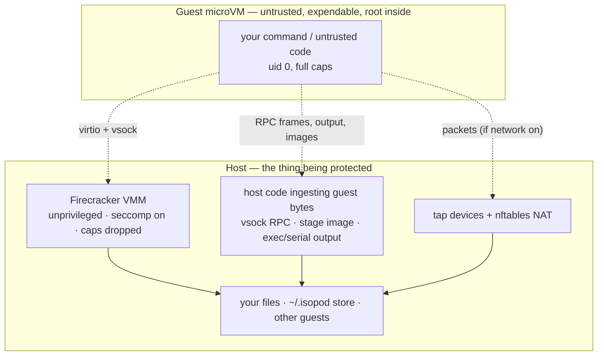

# Security Policy

isopod runs commands inside hardware-isolated Firecracker microVMs. Its whole purpose is to contain code you would not run directly on your host. This document states the security model plainly — what the boundary is, what holds, what the **v1** limitations are — and how to report a vulnerability.

---

## Supported versions

isopod is pre-1.0. The supported line is **`main`**. Fixes land there; there are no separately maintained release branches yet.

---

## Reporting a vulnerability

**Please report security vulnerabilities privately, not in the public issue tracker.**

Use **GitHub's private vulnerability reporting** on this repository:

> **Security** tab → **Advisories** → **Report a vulnerability**

That opens a private advisory visible only to you and the maintainers. Include what you were able to do, the affected code path if you know it, and a proof of concept or reproduction steps if you have one.

Please do **not** open a public issue, pull request, or discussion for a security bug, and please give maintainers a reasonable window to ship a fix before disclosing publicly.

---

## Threat model and isolation boundary

Inside an isopod guest, **untrusted code runs as root by design** — with full capabilities, no in-guest seccomp, and a full device tree. This is intentional: the guest is expendable and fully owned by whatever runs in it. There is nothing to protect *inside* the VM.

The security boundary is therefore **not** the inside of the guest. It is:

1. the **Firecracker VMM + KVM** (the hardware-virtualization boundary),
2. the **host-side code that ingests guest-controlled bytes** (the vsock RPC responses, the committed ext4 stage image, exec and serial output), and
3. the **network fabric** (the tap devices and nftables rules).

A finding only matters if it crosses that boundary: host code execution, host file read/write outside the VM, host denial-of-service, or cross-contamination of another guest or the shared stage/snapshot store.

---

## What holds

The load-bearing controls are configured conservatively:

- **The VMM is hardened.** Firecracker runs **unprivileged** (in the `kvm` group), with its **seccomp BPF filter on** (never `--no-seccomp`), **all capabilities dropped**, and `no_new_privs` set.
- **Guest→host is blocked.** A guest cannot reach host services; the guest→host vsock path (to the host CID) is reset and MMDS is not configured.
- **Guest→guest is blocked.** Concurrent guests on different network slots cannot reach one another (`tap↔tap` drop in the nftables ruleset).
- **`--no-network` is airtight.** With no NIC attached, the guest has no route out at all; exec still works because control RPC is vsock, not the network.
- **No host filesystem is shared into the guest.** The base image is read-only at the VMM; there is no 9p/virtiofs/host mount. Files move in and out only via explicit RPC.
- **Stages are immutable.** A committed stage is content-addressed (blake3) and never mutated; the host `cp --sparse`-copies and hashes the guest ext4 image but never mounts, `fsck`s, or `resize2fs`es it.
- **Resource requests are bounded before boot.** Over-cap memory/vCPU requests are rejected cleanly, without booting a VM.
- **`commit_as` labels are injection-safe.** Labels are stored as pure metadata; path-traversal, command-substitution, and argument-injection attempts produce content-addressed ids and sanitized names, never a host artifact.
- **Guest egress is destination-filtered by default.** A networked guest reaches the public internet but **not** the host's private network: tap-sourced traffic to RFC1918, CGNAT (`100.64.0.0/10`), and link-local/metadata (`169.254.0.0/16`) is dropped, per-tap anti-spoofing pins each slot to its own source address, and IPv6 forwarding for guests is denied. (Operators who need LAN reachability opt in explicitly with `isopod setup --allow-lan-egress`.)

---

## Optional second isolation layer — the rootless jail

isopod can wrap each Firecracker in a **rootless microjail** — set **`ISOPOD_JAIL=1`** in the environment of the runtime (CLI or MCP server). With no privileged host component it adds:

- a **user + pid namespace** with a single-id map, so a VMM/KVM escape lands as an **unprivileged, unmapped uid on the host** (no host capabilities), not your account;
- a **minimal chroot** (built from identity bind mounts) exposing only the VM's own files + `/dev/kvm` + the tap device — **your home directory and the rest of `~/.isopod` are not visible**;
- a **per-VM cgroup v2 slice** with `memory.max` / `cpu.max` / `pids.max`, so a runaway guest is cgroup-OOM-killed and cannot exhaust host RAM, CPU, or pids.

It requires an environment that supports it: unprivileged user namespaces, a delegated cgroup v2 subtree (a normal systemd user session), and membership in the `kvm` group. When enabled, isopod runs a preflight and **fails closed** with a clear message if any prerequisite is missing (it never silently runs unjailed). It is **opt-in in this release** for portability; enabling it is strongly recommended for untrusted or multi-tenant workloads.

---

## Known limitations (v1)

isopod v1 is honest about its posture. State these before running anything genuinely hostile:

- **Without `ISOPOD_JAIL=1`, isolation is single-layer.** The default path relies on Firecracker's seccomp filter + KVM alone; a hypothetical VMM/KVM escape would land as your own user account with access to the whole `~/.isopod` store. Enable the jail (above) — or treat the host as **single-tenant** — before running mutually distrusting workloads.
- **Guest-controlled host sinks are capped, but retention is manual.** Exec output logs are capped at **64 MiB per stream** and serial console logs at **16 MiB** (beyond the cap, bytes are counted but not persisted); every guest RPC the host waits on is **time-bounded**, and each run's wall budget is capped at **3600 s**. Capped logs are still retained per VM until pruned — run `vm_gc` regularly; automatic log retention/GC is not yet wired.
- **No global governor across concurrent VMs.** The jail's `memory.max` bounds each VM, but many unjailed VMs can still over-commit host RAM. Per-drive/NIC bandwidth rate limiters are also not yet wired. Prefer bounded workloads until these land.

---

## Guidance for operators

- **Enable the jail for untrusted code:** set `ISOPOD_JAIL=1` for the runtime, and/or run adversarial code with networking off (`isopod run --no-network -- …` / `sandbox_run(..., network=false)`).
- **Keep it single-tenant** unless the jail is enabled — do not rely on one unjailed isopod host to isolate mutually distrusting tenants from each other.
- **Do not bake secrets into a stage** that will be forked and shared; forks inherit the stage's contents.
- **Prune regularly.** `vm_gc` reaps orphaned Firecracker processes and old VM record directories; `stage_rm` removes stages you no longer need.

For the full design rationale behind these controls, see [PLAN.md](PLAN.md) (the "Security posture" section) and the milestone log.
