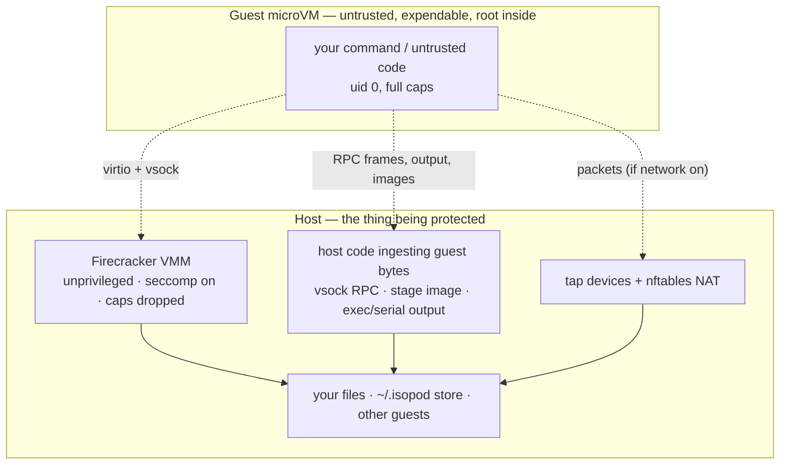

# Security Policy

isopod runs commands inside hardware-isolated Firecracker microVMs. Its whole purpose is to contain code you would not run directly on your host. This document states the security model plainly — what the boundary is, what holds, what the **v1** limitations are — and how to report a vulnerability.

---

## Supported versions

isopod is pre-1.0. The supported line is **`main`**. Fixes land there; there are no separately maintained release branches yet.

---

## Reporting a vulnerability

**Please report security vulnerabilities privately, not in the public issue tracker.**

Use **GitHub's private vulnerability reporting** on this repository:

> **Security** tab → **Advisories** → **Report a vulnerability**

That opens a private advisory visible only to you and the maintainers. Include what you were able to do, the affected code path if you know it, and a proof of concept or reproduction steps if you have one.

Please do **not** open a public issue, pull request, or discussion for a security bug, and please give maintainers a reasonable window to ship a fix before disclosing publicly.

---

## Threat model and isolation boundary

Inside an isopod guest, **untrusted code runs as root by design** — with full capabilities, no in-guest seccomp, and a full device tree. This is intentional: the guest is expendable and fully owned by whatever runs in it. There is nothing to protect *inside* the VM.

The security boundary is therefore **not** the inside of the guest. It is:

1. the **Firecracker VMM + KVM** (the hardware-virtualization boundary),
2. the **host-side code that ingests guest-controlled bytes** (the vsock RPC responses, the committed ext4 stage image, exec and serial output), and
3. the **network fabric** (the tap devices and nftables rules).

A finding only matters if it crosses that boundary: host code execution, host file read/write outside the VM, host denial-of-service, or cross-contamination of another guest or the shared stage/snapshot store.

---

## What holds

The load-bearing controls are configured conservatively:

- **The VMM is hardened.** Firecracker runs **unprivileged** (in the `kvm` group), with its **seccomp BPF filter on** (never `--no-seccomp`), **all capabilities dropped**, and `no_new_privs` set.
- **Guest→host is blocked.** A guest cannot reach host services; the guest→host vsock path (to the host CID) is reset and MMDS is not configured.
- **Guest→guest is blocked.** Concurrent guests on different network slots cannot reach one another (`tap↔tap` drop in the nftables ruleset).
- **`--no-network` is airtight.** With no NIC attached, the guest has no route out at all; exec still works because control RPC is vsock, not the network.
- **No host filesystem is shared into the guest.** The base image is read-only at the VMM; there is no 9p/virtiofs/host mount. Files move in and out only via explicit RPC.
- **Stages are immutable.** A committed stage is content-addressed (blake3) and never mutated; the host `cp --sparse`-copies and hashes the guest ext4 image but never mounts, `fsck`s, or `resize2fs`es it.
- **Resource requests are bounded before boot.** Over-cap memory/vCPU requests are rejected cleanly, without booting a VM.
- **`commit_as` labels are injection-safe.** Labels are stored as pure metadata; path-traversal, command-substitution, and argument-injection attempts produce content-addressed ids and sanitized names, never a host artifact.

---

## Known limitations (v1)

isopod v1 is honest about its posture. State these limitations before running anything genuinely hostile or multi-tenant:

- **Single-layer isolation.** v1 relies on Firecracker's seccomp filter + KVM alone. The second isolation layer — the **jailer** (chroot + dedicated uid + namespaces + cgroup v2 caps) — is planned for **v2**. Until it lands, treat isopod as **single-tenant**: a hypothetical VMM/KVM escape would land as your own user account, with access to the whole `~/.isopod` store.
- **A networked guest can reach your whole routable network.** NAT egress is currently unrestricted by destination, so a guest with networking on can reach not just the public internet but anything the host can route to — including your **private LAN** (router admin pages, internal services, other machines on the subnet) and, on a cloud host, the instance metadata endpoint. Destination-filtered (public-only) egress is planned. **Until then, run untrusted code with `--no-network` (CLI) / `network=false` (MCP).**
- **Resource-exhaustion hardening is in progress.** Output-log size caps, an outer run deadline / vsock read timeouts, a concurrent-VM memory governor, and per-drive/NIC rate limiters are still being built. A single untrusted run can currently fill host disk with log output, and many concurrent VMs can over-commit host RAM. Prefer bounded, trusted workloads and prune the store (`vm_gc`) until these land.

---

## Guidance for operators

- **Run untrusted or adversarial code with networking off.** `isopod run --no-network -- …` / `sandbox_run(..., network=false)`.
- **Keep it single-tenant** on v1 — do not use one isopod host to isolate mutually distrusting tenants from each other.
- **Do not bake secrets into a stage** that will be forked and shared; forks inherit the stage's contents.
- **Prune regularly.** `vm_gc` reaps orphaned Firecracker processes and old VM record directories; `stage_rm` removes stages you no longer need.

For the full design rationale behind these controls, see [PLAN.md](PLAN.md) (the "Security posture" section) and the milestone log.
