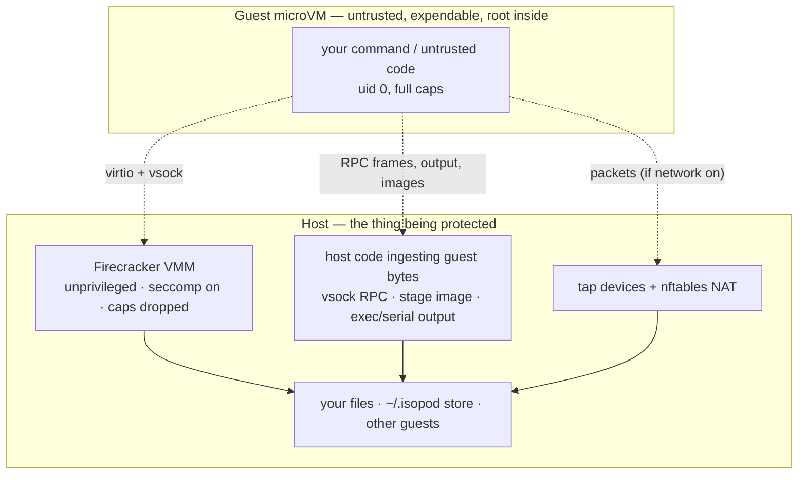
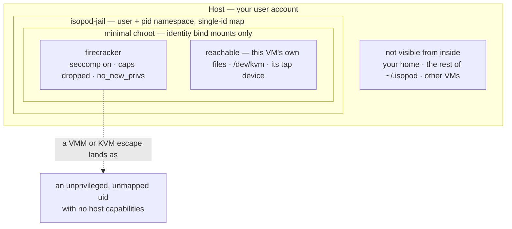

# Security Policy

isopod runs commands inside hardware-isolated Firecracker microVMs. Its whole purpose is to contain code you would not run directly on your host. This document states the security model plainly — what the boundary is, what holds, what the **v1** limitations are — and how to report a vulnerability.

---

## Supported versions

isopod is pre-1.0. The supported line is **`main`**. Fixes land there; there are no separately maintained release branches yet.

---

## Reporting a vulnerability

**Please report security vulnerabilities privately, not in the public issue tracker.**

Use **GitHub's private vulnerability reporting** on this repository:

> **Security** tab → **Advisories** → **Report a vulnerability**

That opens a private advisory visible only to you and the maintainers. Include what you were able to do, the affected code path if you know it, and a proof of concept or reproduction steps if you have one.

Please do **not** open a public issue, pull request, or discussion for a security bug, and please give maintainers a reasonable window to ship a fix before disclosing publicly.

---

## Threat model and isolation boundary

Inside an isopod guest, **untrusted code runs as root by design** — with full capabilities, no in-guest seccomp, and a full device tree. This is intentional: the guest is expendable and fully owned by whatever runs in it. There is nothing to protect *inside* the VM.

The security boundary is therefore **not** the inside of the guest. It is:

1. the **Firecracker VMM + KVM** (the hardware-virtualization boundary),
2. the **host-side code that ingests guest-controlled bytes** (the vsock RPC responses, the committed ext4 stage image, exec and serial output), and
3. the **network fabric** (the tap devices and nftables rules).

```mermaid
flowchart TB
    subgraph GUEST["Guest microVM — untrusted, expendable, root inside"]
        CODE["your command / untrusted code<br/>uid 0, full caps"]
    end
    subgraph HOST["Host — the thing being protected"]
        VMM["Firecracker VMM<br/>unprivileged · seccomp on · caps dropped"]
        INGEST["host code ingesting guest bytes<br/>vsock RPC · stage image · exec/serial output"]
        NET["tap devices + nftables NAT"]
        REST["your files · ~/.isopod store · other guests"]
    end
    CODE -.->|"virtio + vsock"| VMM
    CODE -.->|"RPC frames, output, images"| INGEST
    CODE -.->|"packets (if network on)"| NET
    VMM --> REST
    INGEST --> REST
    NET --> REST
```

A finding only matters if it crosses that boundary: host code execution, host file read/write outside the VM, host denial-of-service, or cross-contamination of another guest or the shared stage/snapshot store.

---

## What holds

The load-bearing controls are configured conservatively:

- **The VMM is hardened.** Firecracker runs **unprivileged** (in the `kvm` group), with its **seccomp BPF filter on** (never `--no-seccomp`), **all capabilities dropped**, and `no_new_privs` set.
- **Guest→host is blocked.** A guest cannot reach host services; the guest→host vsock path (to the host CID) is reset and MMDS is not configured.
- **Guest→guest is blocked.** Concurrent guests on different network slots cannot reach one another (`tap↔tap` drop in the nftables ruleset).
- **A network slot has one run on it.** A slot is claimed by an exclusive `flock` held for the run's lifetime, so no timing, no crash, and no concurrency gets two runs onto one tap and `/30`. The kernel releases the lock when the owning process dies — `kill -9` included — so there is no lock to sweep and no bookkeeping to reconcile. That is a statement about the *lock*, not about the slot: a `kill -9` of the supervisor leaves its Firecracker running and still holding the tap, so the slot is not usable until the next run's `reap_orphans` SIGKILLs it — which does test pid liveness, on a recorded pid and start time.
- **`--no-network` is airtight.** With no NIC attached, the guest has no route out at all; exec still works because control RPC is vsock, not the network.
- **No host filesystem is shared into the guest.** The base image is read-only at the VMM; there is no 9p/virtiofs/host mount. Files move in and out only via explicit RPC.
- **Stages are immutable.** A committed stage is content-addressed (blake3) and never mutated; the host `cp --sparse`-copies and hashes the guest ext4 image but never mounts, `fsck`s, or `resize2fs`es it.
- **Resource requests are bounded before boot.** Over-cap memory/vCPU requests are rejected cleanly, without booting a VM.
- **`commit_as` labels are injection-safe.** Labels are stored as pure metadata; path-traversal, command-substitution, and argument-injection attempts produce content-addressed ids and sanitized names, never a host artifact.
- **Guest egress is destination-filtered by default.** A networked guest reaches the public internet but **not** the host's private network: tap-sourced traffic to RFC1918, CGNAT (`100.64.0.0/10`), and link-local/metadata (`169.254.0.0/16`) is dropped, per-tap anti-spoofing pins each slot to its own source address, and IPv6 forwarding for guests is denied. (Operators who need LAN reachability opt in explicitly with `isopod setup --allow-lan-egress`.)

---

## Optional second isolation layer — the rootless jail

isopod can wrap each Firecracker in a **rootless microjail** — set **`ISOPOD_JAIL=1`** in the environment of the runtime (CLI or MCP server). With no privileged host component it adds:

- a **user + pid namespace** with a single-id map, so a VMM/KVM escape lands as an **unprivileged, unmapped uid on the host** (no host capabilities), not your account;
- a **minimal chroot** (built from identity bind mounts) exposing only the VM's own files + `/dev/kvm` + the tap device — **your home directory and the rest of `~/.isopod` are not visible**;
- a **per-VM cgroup v2 slice** with `memory.max` / `cpu.max` / `pids.max`, so a runaway guest is cgroup-OOM-killed and cannot exhaust host RAM, CPU, or pids.

Drawn as containment layers — what an escape from the box in the middle would still have to get through:

```mermaid
flowchart TB
    subgraph HOST["Host — your user account"]
        HIDE["not visible from inside<br/>your home · the rest of ~/.isopod · other VMs"]
        subgraph JAIL["isopod-jail — user + pid namespace, single-id map<br/>per-VM cgroup v2 slice with memory.max · cpu.max · pids.max"]
            subgraph CH["minimal chroot — identity bind mounts only"]
                FCP["firecracker<br/>seccomp on · caps dropped · no_new_privs"]
                SEEN["reachable — this VM's own files · /dev/kvm · its tap device"]
            end
        end
    end
    FCP -.->|"a VMM or KVM escape lands as"| ESC["an unprivileged, unmapped uid<br/>with no host capabilities"]
```

Without `ISOPOD_JAIL=1` the two inner boxes do not exist, and that dashed arrow lands in the outermost one — as your own account, with your files and the whole `~/.isopod` store in reach.

It requires an environment that supports it: unprivileged user namespaces, a delegated cgroup v2 subtree (a normal systemd user session), and membership in the `kvm` group. When enabled, isopod runs a preflight and **fails closed** with a clear message if any prerequisite is missing (it never silently runs unjailed). It is **opt-in in this release** for portability; enabling it is strongly recommended for untrusted or multi-tenant workloads.

---

## Known limitations (v1)

isopod v1 is honest about its posture. State these before running anything genuinely hostile:

- **Without `ISOPOD_JAIL=1`, isolation is single-layer.** The default path relies on Firecracker's seccomp filter + KVM alone; a hypothetical VMM/KVM escape would land as your own user account with access to the whole `~/.isopod` store. Enable the jail (above) — or treat the host as **single-tenant** — before running mutually distrusting workloads.
- **Guest-controlled host sinks are capped, but retention is manual.** Exec output logs are capped at **64 MiB per stream** and serial console logs at **16 MiB** (beyond the cap, bytes are counted but not persisted); every guest RPC the host waits on is **time-bounded**, and each run's wall budget is capped at **3600 s**. Capped logs are still retained per VM until pruned — run `vm_gc` regularly; automatic log retention/GC is not yet wired.
- **No global governor across concurrent VMs.** The jail's `memory.max` bounds each VM, but many unjailed VMs can still over-commit host RAM. Per-drive/NIC bandwidth rate limiters are also not yet wired. Prefer bounded workloads until these land.

---

## Filtered egress — the allowlist the guest cannot rewrite

A run started with `--allow-host` / `--allow-cidr` / `--deny-egress` (or MCP `allow_hosts` / `allow_cidrs`) claims a **filtered** network slot instead of a public one. Two controls apply, both on the host, outside the guest boundary:

1. **The packet filter.** `sudo isopod setup` bakes `iifname "isopod-tap<i>" drop` into the forward chain for every filtered slot — all forwarding, not just to the WAN. The only rule that lets anything in from a filtered tap is a narrow input `accept` for the broker's own ports on that slot's own gateway, pinned on arrival interface, destination address, and port. This is set once, as root, at provisioning time; the unprivileged runtime never edits nftables — so a port a given host was not provisioned with is unreachable, and a run that needs one fails closed with the re-provisioning command rather than hanging.
2. **The kernel's own forwarding flag.** `setup` also clears `net.ipv4.conf.isopod-tap<i>.forwarding` for every filtered tap, so the routing layer refuses to forward what arrives there **whether or not the ruleset is loaded**. This is deliberately redundant with (1), and it is the one part of a filtered slot's enforcement an unprivileged process can *read back*: reading the live nftables ruleset needs `CAP_NET_ADMIN`, that file is world-readable. Every filtered run verifies it before booting and fails closed with the re-provisioning command if it is not in place.
3. **The egress broker.** A host-side SOCKS5 / HTTP-proxy / DNS responder on the slot gateway, running as tokio tasks inside the VM supervisor process. It resolves and dials on the guest's behalf, only for destinations on the run's allowlist, and records every decision. It serves **only its own slot's guest address** — the listeners are bound to a host address, so without a peer check every process on the machine could drive them.

### What holds

- A root guest **cannot reach a destination that is not on its allowlist**, by any protocol. Its slot forwards nothing; its only reachable peer is the broker.
- A root guest **cannot exfiltrate over DNS**. Its `:53` is redirected to a responder that answers allowlisted names and `NXDOMAIN`s everything else. There is no route to any other resolver.
- A root guest **cannot rewrite its allowlist**. The packet filter is set at `sudo isopod setup`; the broker's rules are memory in a process the guest cannot address at all.
- A **literal IP address is never matched against a name pattern.** Allowlisting `pypi.org` does not permit dialling the address `pypi.org` resolves to — otherwise a guest could sidestep the allowlist by resolving names itself. (The broker does accept an address *it* returned for an allowed name, so proxy clients that resolve locally still work; that grants nothing a `CONNECT allowed-name:443` tunnel does not already grant.)
- **DNS aimed at any resolver is intercepted, not merely dropped.** A query sent straight to `8.8.8.8` is redirected to the broker by a setup-time rule, so malware with a hardcoded resolver is policy-enforced rather than left to fail and fall back.
- **Nothing the guest names reaches your terminal or your model verbatim.** Host headers, SNI values and DNS labels are validated before being recorded; anything that is not a well-formed host name is stored as `<invalid:N>` with the byte count and nothing else.
- **An allowlisted name that resolves inward is still refused.** The broker dials from the *host*, where the packet filter's public-only-egress rule — which governs forwarded traffic — does not apply. So the address every allowed destination resolves to is checked after resolution: loopback, link-local (including `169.254.169.254`), multicast, IPv4-mapped spellings of those, and isopod's own `10.107.0.0/16` are refused outright; private and CGNAT ranges follow the host's `--allow-lan-egress`. This covers the proxy path, the DNS answers the broker synthesises, and the credential endpoint's upstream leg.
- **One run cannot reach another run's broker.** Sibling slots live in `10.107.0.0/16`, which is refused as a destination even with `--allow-lan-egress`, and each broker serves only its own guest's address.

### What is explicitly **not** claimed

- **Allowlisting is destination control, not DLP.** If you allowlist `github.com`, data can leave to `github.com`. The broker does not terminate TLS, so it cannot see or restrict what flows through an allowed tunnel.
- **A tunnel to a shared address is a tunnel to that address.** Allowlisting one name on a CDN gives a TCP path to an IP that may serve many origins, and the guest chooses the SNI it sends. Name-level enforcement without interception cannot separate them.
- **Ignoring the proxy environment is not a bypass — it is a self-inflicted outage.** The packet filter drops the traffic either way. But a tool that reads neither `*_PROXY` nor `getaddrinfo` will report a confusing network error rather than a policy denial. This is a compatibility caveat, not a security one.
- **Wildcards do not cover the apex.** `*.example.com` matches `files.example.com` and neither `example.com` nor `a.b.example.com`. List both if you want both.
- **The guest→host half of the guarantee is not runtime-verified.** "Host services are unreachable from a filtered guest" rests on the nftables input chain, and an unprivileged process cannot read the live ruleset to confirm it. Be precise about what the forwarding flag does for a flushed table: it **contains** the flush — the kernel still refuses to forward off the tap, so egress stops — but it does not **detect** it, because flushing nftables does not change the flag. A filtered run on a host whose ruleset has been flushed will therefore start, reach nothing, and leave the input drop absent. Treat `nft flush ruleset` — or anything that performs one, such as a firewalld reload — as requiring `sudo isopod setup` before the next filtered run, and do not run services on the slot gateways.

---

## Injected credentials — spent by the run, never held by it

A run started with `--inject <alias>` (or MCP `inject`) can authorise specific requests against one host without ever receiving the token. The alias, the secret's source, the single permitted host, and the exact set of permitted requests are all declared host-side in `~/.isopod/credentials.json` (mode `0600`); the run names only the alias. A fourth broker listener on the slot gateway (port 3129) accepts a *stated intent* and **constructs a new request from its own parts** — it is not a reverse proxy, because the guest does not compose the request. What does cross to the upstream is a path the normaliser accepted and an `allow` rule matched, that path's query verbatim, at most two allowlisted header values, and a bounded body; what never crosses is anything deciding where the request goes or who it is from. Full design: [docs/credentials.md](docs/credentials.md).

### What holds

- **The token never enters the guest**, the stage store, the exec environment, or a model's context. It lives in the supervisor process and is attached to a request the host builds.
- **The guest cannot choose what the credential signs** beyond the credential's `allow` list. That list is mandatory and has no default — a credential without one fails to load — because a credential scoped only by host means "anything this token can do to that API", including planting a key that outlives the VM.
- **The request cannot be relocated off its pinned origin.** The scheme is always `https` and the authority is always the declared host; neither is derived from anything the guest sent. Scheme-relative, absolute-form, backslash, dot-segment and percent-encoded-separator targets are all rejected before a rule is matched.
- **Redirects are not followed.** A `30x` is relayed to the guest as a `30x`. Chasing one would carry the `Authorization` header to a host the operator never named, chosen by a party who is not the operator.
- **A credential does not come with a network.** Naming one switches the run to a filtered slot; it never lands on a public slot with unfiltered NAT egress.
- **Refusals do not enumerate your credential names.** Over MCP, "no such alias", "not opted in for model callers", and "the source did not resolve" render identically. The specific reason goes to the host's stderr.
- **Only the run it was injected into can spend it.** The endpoint is a TCP port on the slot gateway, which is a *host* address — the input rule that gates guest access is pinned to the tap and cannot match a locally-generated packet. So the listener checks the peer and serves only that slot's guest. Without it, any local account could `curl http://10.107.8.1:3129/github/user` while the run was live and have the calls recorded as the sandbox's.
- **The token cannot be redirected to a host service by DNS.** The upstream leg resolves through the same destination floor as the proxy path, so a pinned host whose DNS answers `127.0.0.1` gets no connection rather than an `Authorization` header.
- **The MCP surface cannot read the store.** `sandbox_run`'s two host-path arguments — `stdin_file` and `copy_out[].host` — are confined to a root that defaults to the server's working directory, with symlinks resolved before the check (a link whose target does not exist yet is refused rather than written through, and a multiply-linked file is refused outright). A write destination is normalised before any of that runs — trailing separators and `.` components dropped, `..` still refused — so no guard sees a different final component from the one that will be opened, and the write itself opens with `O_NOFOLLOW` so it refuses to traverse a symlink whatever the check concluded. isopod's own state directory is refused **whatever the root is, and with the confinement switched off** — the root defaults to the server's working directory, and `$HOME` is an ordinary working directory for an MCP registration, which would otherwise put `~/.isopod` inside the confinement. Unconfined, they were an arbitrary host read and an arbitrary host write: enough to read the store, read its `file:` sources, or rewrite it. `ISOPOD_MCP_HOST_IO_ROOT` moves the root (`/` disables the confinement), and `ISOPOD_MCP_HOST_IO` / `ISOPOD_MCP_STDIN_FILE` / `ISOPOD_MCP_COPY_OUT` set to `off` refuse the arguments outright. The startup log line states which is in force. The CLI is unaffected: there the caller is the operator.

### What is explicitly **not** claimed

- **A credential is not a capability boundary between processes in one run.** Every process in the guest can reach the endpoint — it is a TCP port on the gateway, and an unguessable path would be theatre, since anything that can read the exec environment can read the URL. **Scope the `allow` list as though hostile code will use it.** If you need process-level separation, use two runs.
- **Allowlisting a read is not confidentiality.** What the pinned host returns is relayed to the run as-is. A `readonly` credential still lets everything in that run see everything that read returns.
- **The endpoint does not inspect payloads.** A permitted `POST` may carry whatever body the run chooses, within the size ceiling. Scope by method and path; that is the whole of the mechanism.
- **A rule scopes the method and the path, not the query string.** Everything after the first `?` is chosen by the run and passed to the upstream verbatim. For the overwhelming majority of APIs that is exactly right — a query filters or paginates a resource the rule already named — but if an API dispatches *operations* through its query string, a path-shaped rule will not separate them. Scope such a credential by giving it its own alias with the narrowest path you can, and treat the query as part of what you are trusting the run with.
- **The token is not protected against a host-local attacker.** `Secret` prevents accidental logging and serialization by construction, but it is not zeroized on drop and offers nothing against something that can read this process's memory. The peer check above raises the bar for a *local account* — it must forge a source address, which needs root — but root on the host is already the operator. That is the same single-user, single-tenant assumption stated above.
- **Confining a path is not confining an inode.** The host-I/O root is enforced by resolving a path and testing its prefix. That resolves symlinks — including a link planted inside the root, and including one whose target does not exist yet — but a **hard link** is a second name for the same inode, so it resolves to itself and passes. isopod therefore refuses any multiply-linked file outright, which is the only answer a path-based check has. If you need a stronger boundary than that, run the server with `ISOPOD_MCP_COPY_OUT=off` and take artifacts out through `stdout`.
- **A path check and an `open` are two lookups, and this one has come apart twice.** The first shipped version of the confinement was defeated by a dangling symlink; the fix for that was defeated by writing the same link with a trailing separator, which made `symlink_metadata` report `ENOTDIR` and skipped the guard entirely. Both were demonstrated end to end against a real server, and the second **overwrote** an existing host file while reporting the in-root path back. The write now normalises the destination before any guard runs and opens the final component with `O_NOFOLLOW`, which is what makes the guarantee independent of the check — a symlink planted at the destination between the check and the open is refused by the kernel. Treat that as the load-bearing control and the path check as defence in depth, not the other way round.

  **The parent chain is not covered by that, and is not claimed to be.** `O_NOFOLLOW` applies to the final component; the destination's parent directories are still created with `create_dir_all`, which follows symlinks and is not re-checked against the root. So a directory in the already-resolved prefix that is *replaced by a symlink after the check and before the copy* would relocate the write — a window as long as the run. `copy_out` cannot create a host symlink and `stdin_file` only reads, so nothing the sandbox does opens that window; it needs something else on the host writing into the root while a run is in flight, which the default root (the server's working directory) does not rule out. Closing it properly means resolving the whole path from a directory descriptor taken at check time (`openat2(RESOLVE_BENEATH)`), which is the fix on the list rather than one that has shipped.
- **A host-I/O root is not a sandbox.** Confining `stdin_file` and `copy_out[].host` to a directory keeps the credential store and its sources out of reach; it does not make the files *inside* that root safe. `copy_out` writes guest-authored bytes to a path the caller names, so anything under the root — your source tree, by default — can be overwritten by the sandbox. Modes are masked (never setuid/setgid/sticky, never group- or world-writable), which stops the write from becoming a privilege escalation, not from being a write. Point the root somewhere disposable if that matters, or set `ISOPOD_MCP_COPY_OUT=off`.

---

## Guidance for operators

- **Enable the jail for untrusted code:** set `ISOPOD_JAIL=1` for the runtime, and/or run adversarial code with networking off (`isopod run --no-network -- …` / `sandbox_run(..., network=false)`).
- **Prefer a tight allowlist to no network at all** when the workload genuinely needs one dependency source: `--allow-host pypi.org --allow-host '*.pythonhosted.org'` fails closed on everything else and leaves an audit trail. Use `--deny-egress` to watch a suspect dependency's outbound attempts without letting any of them succeed.
- **Keep it single-tenant** unless the jail is enabled — do not rely on one unjailed isopod host to isolate mutually distrusting tenants from each other.
- **Do not bake secrets into a stage** that will be forked and shared; forks inherit the stage's contents.
- **Prune regularly.** `vm_gc` reaps orphaned Firecracker processes and old VM record directories; `stage_rm` removes stages you no longer need.

The filtered-egress claims above are exercised against a real VM and recorded, attempt by attempt, in [docs/egress-ledger.md](docs/egress-ledger.md) — including which of the two layers caught each one.

For the full design rationale behind these controls, see [PLAN.md](PLAN.md) (the "Security posture" section) and the milestone log. The pre-publication breakout assessment — live escape attempts plus an adversarially-verified static review of every host-side code path that ingests guest-controlled data, and the origin of the hardening items above — is published in full at [docs/security-assessment.md](docs/security-assessment.md).
