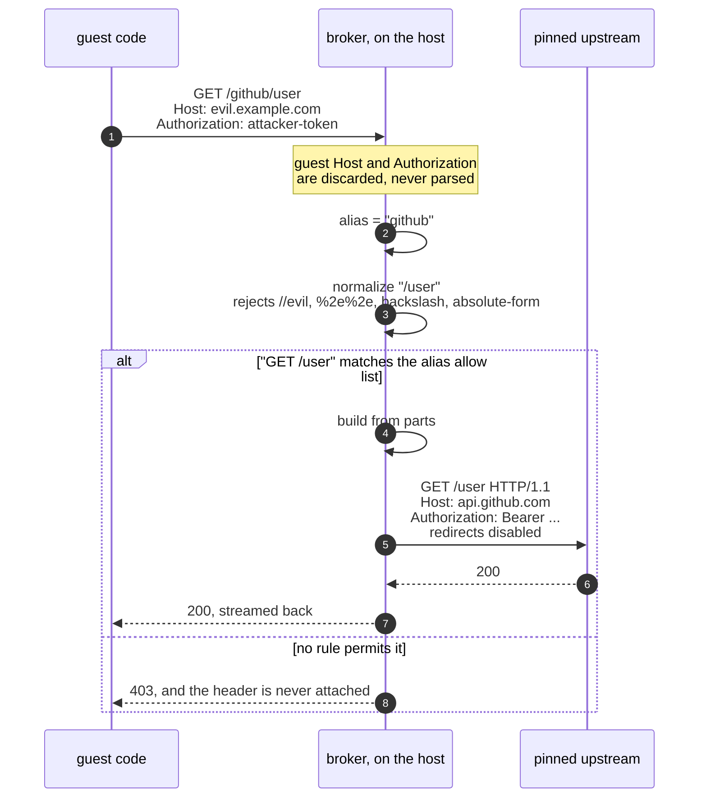
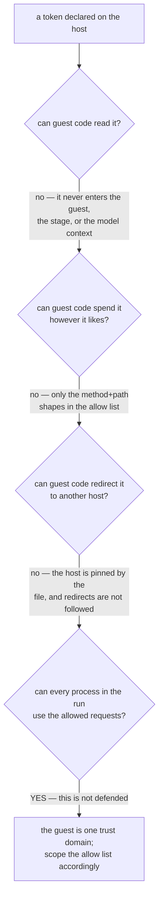

# Credentials

> **Status: the enforcement core has landed; the wiring has not.** The types,
> the credential store, and every policy decision below are implemented and
> tested on `main`. The listener, the upstream TLS leg, and the `--inject` flag
> arrive in **0.10.0**. Nothing on this page is reachable from a run yet — it is
> published now because the design is settled and the security argument is the
> part worth reviewing early.

A sandboxed workload often needs exactly one credential — a package registry
token, one API key — and giving it the token means giving *all* the code in that
run the ability to spend it however it likes.

isopod's answer is that the run never receives the token at all. It receives an
**alias**. The operator declares, on the host, which secret that alias names,
which single host it may be sent to, and **which requests it may authorise**.

---

## Why not simply hand the token to the guest?

Because the interesting attack is not reading the token. It is *spending* it.

A first design let the caller name the secret inline
(`inject_bearer: {"host": "file:/home/u/.ssh/id_rsa"}`). Over MCP the caller is
a model whose context can be poisoned by the very code being sandboxed — so that
was an arbitrary host-file read-and-exfiltrate primitive wearing a credential's
clothes.

The redesign was then red-teamed across eleven independent attack angles. Six
findings converged on one point, which shaped everything below:

> Stopping the guest from *reading* a token is easy. If the broker forwards a
> request the guest composed, the guest still chooses what the credential
> **signs**.

`POST /user/keys` plants an attacker-held key that outlives the VM. A
scheme-relative target like `//evil.com/x` relocates the request off its pinned
origin. A verbatim `Host:` header delivers the `Authorization` to a different
server. A blindly-followed 30x carries it somewhere else again.

So the endpoint is **not a reverse proxy**. Guest bytes never reach the wire.

---

## How a request is authorised

The guest states an intent. The broker builds a *new* request from its own parts
— but only if that intent matches a rule the operator wrote by hand.



Everything the guest could use to relocate the request is either rejected at
parse time or simply not carried forward. The scheme is always `https` and the
authority is always the pinned host, so there is no join for a scheme-relative
or absolute-form target to subvert.

---

## Declaring a credential

Credentials live in `~/.isopod/credentials.json`, mode `0600`. A permissive mode
is a hard error, and a symlink is refused outright — the mode is checked on the
link, not its target.

```jsonc
{
  "version": 1,
  "credentials": {
    "github": {
      "host": "api.github.com",     // exact name; no wildcard, no port
      "scheme": "bearer",
      "source": "env:GH_TOKEN",     // or file:/abs/path
      "allow": ["readonly"],        // REQUIRED — see below
      "mcp": true                   // default-deny; opt a model in explicitly
    },
    "statuses": {
      "host": "api.github.com",
      "scheme": "bearer",
      "source": "file:/home/me/.secrets/gh",
      "allow": ["POST /repos/*/*/statuses/*"]
    }
  }
}
```

### `allow` is mandatory

There is no default. A credential without an `allow` list fails to load, because
"I did not think about this" and "I chose read-only" must not look identical in
the file.

| Entry | Means |
|---|---|
| `readonly` | `GET` and `HEAD`, any path. The token cannot change state. |
| `none` | Deny everything — for testing, or to disable a credential without deleting it. |
| `POST /repos/*/*/statuses/*` | One method, one path shape. `*` is exactly one segment; a single trailing `**` is any suffix. |

Presets keep the ordinary case to one word while still requiring you to say it.

---

## What this defends, and what it does not



The last box is the honest one. Every process inside the guest can reach the
endpoint — it is a TCP port on the slot gateway, and an unguessable path would be
theatre, since anything that can read the exec environment can read the URL.

**That is exactly why the `allow` list is mandatory.** The defence is not "only
my program can use this credential". It is "this credential can only do these
specific things". Scope it as if hostile code will use it, because if the run
goes wrong, hostile code will.

Two further limits, stated plainly:

- **A credential is not a capability boundary between processes in one run.**
  If that matters, use two runs.
- **The pinned host is not added to the run's egress allowlist.** A run whose
  only egress input is `--inject github` gets an *empty* allowlist:
  `api.github.com` is `NXDOMAIN`, and the credential endpoint is the one way
  out. Pass `--allow-host api.github.com` as well if you also want direct
  access, and the widening is then explicit and visible in `RunReport.egress`.

---

## Failure is always closed

Credential resolution happens **before** a network slot is claimed and before
any VM work, and it is all-or-nothing. Any of these aborts the run rather than
degrading it:

- the store is absent, malformed, permissive, a symlink, or declares an unknown
  version or key;
- the `env:` variable is unset, or the `file:` source is unreadable, oversized,
  not a regular file, or permissive;
- the resolved token is empty, or contains bytes that cannot appear in an HTTP
  header (a stray newline would split the request the broker builds);
- the alias does not exist, or is not opted in for the caller.

A partial success would let a run proceed believing it holds a credential it
does not — and, worse, could leave the pinned host reachable *without*
authentication.

### Errors never echo a secret

The mistake an operator will actually make is pasting a raw token into `source`
instead of `env:NAME`. No error message repeats the offending value, because
that message reaches stderr, the logs, and possibly a model's context.

For the same reason, a refusal shown to an **MCP caller** is identical whether
the alias does not exist, exists but is not opted in, or exists but failed to
resolve — otherwise a poisoned model context could enumerate your credential
names. The operator still gets the specific reason on the host's stderr.

In the code, a resolved secret lives in a `Secret` newtype with no `Display` and
deliberately **no `Serialize`**: adding `#[derive(Serialize)]` to any struct that
holds one fails to compile. That build error is the feature.

---

## See also

- [Security model](../SECURITY.md) — the isolation boundary and what is not claimed.
- [Egress ledger](egress-ledger.md) — the filtered-egress enforcement this builds on.
- [MCP usage](mcp-usage.md) — the `sandbox_run` surface.
