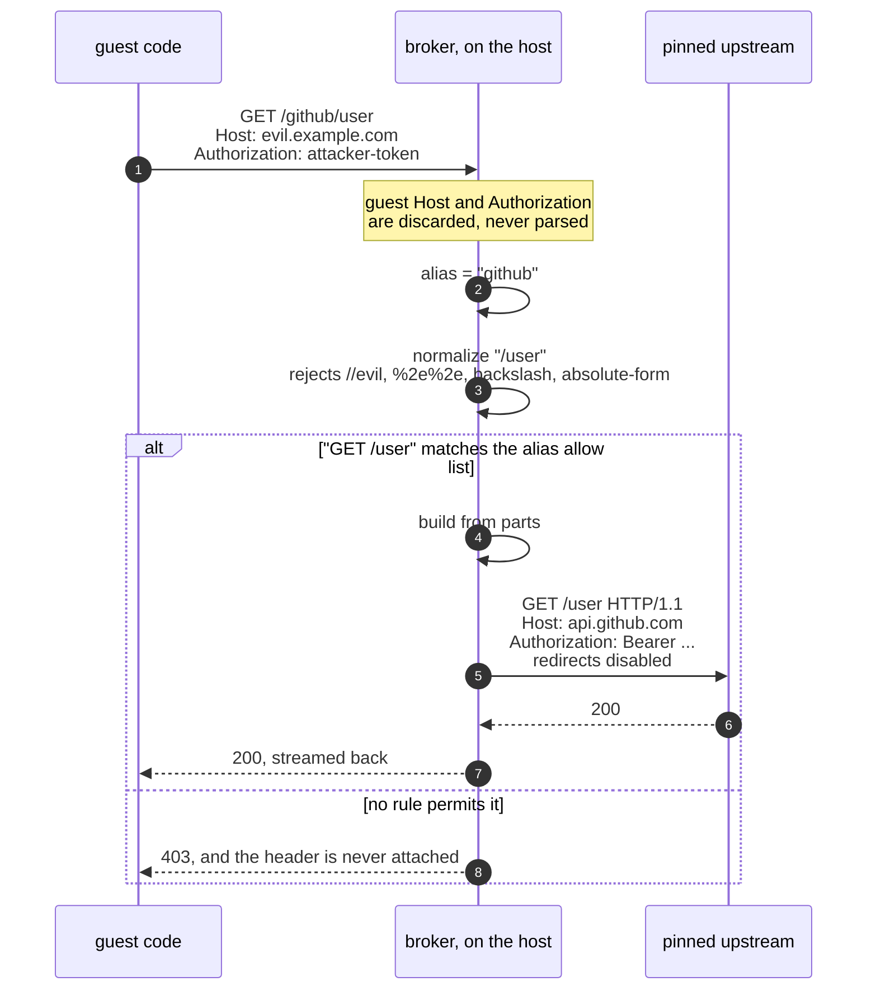
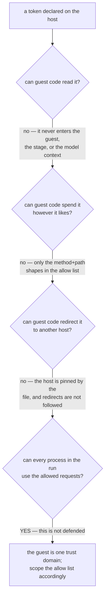
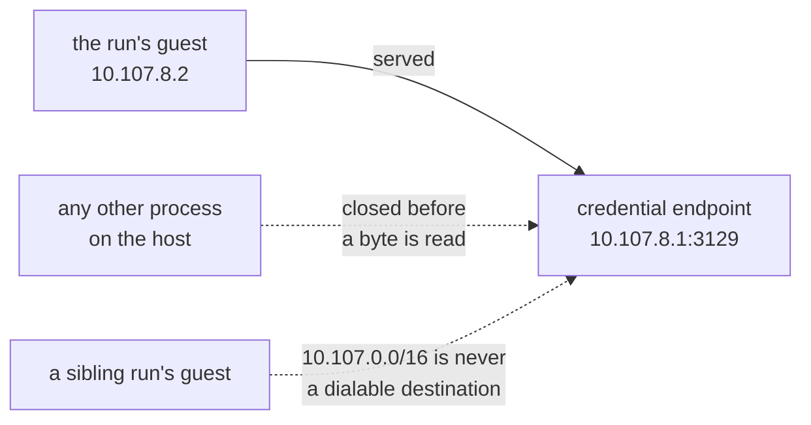
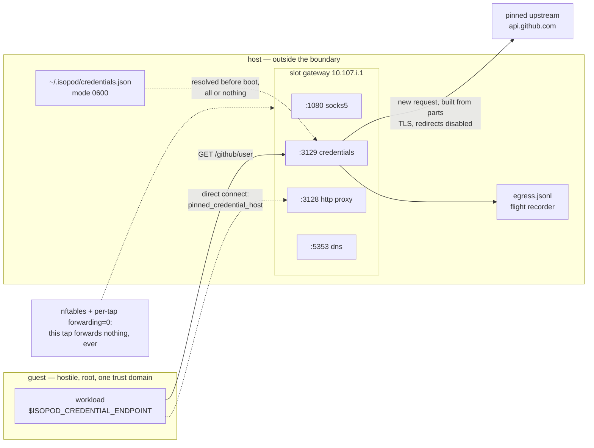
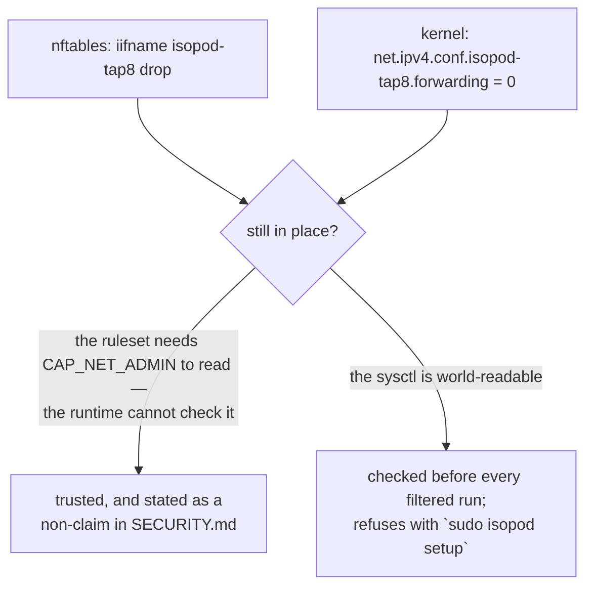

# Credentials

A sandboxed workload often needs exactly one credential — a package registry
token, one API key — and giving it the token means giving *all* the code in that
run the ability to spend it however it likes.

isopod's answer is that the run never receives the token at all. It receives an
**alias**. The operator declares, on the host, which secret that alias names,
which single host it may be sent to, and **which requests it may authorise**.

---

## Why not simply hand the token to the guest?

Because the interesting attack is not reading the token. It is *spending* it.

A first design let the caller name the secret inline
(`inject_bearer: {"host": "file:/home/u/.ssh/id_rsa"}`). Over MCP the caller is
a model whose context can be poisoned by the very code being sandboxed — so that
was an arbitrary host-file read-and-exfiltrate primitive wearing a credential's
clothes.

The redesign was then red-teamed across eleven independent attack angles. Six
findings converged on one point, which shaped everything below:

> Stopping the guest from *reading* a token is easy. If the broker forwards a
> request the guest composed, the guest still chooses what the credential
> **signs**.

`POST /user/keys` plants an attacker-held key that outlives the VM. A
scheme-relative target like `//evil.com/x` relocates the request off its pinned
origin. A verbatim `Host:` header delivers the `Authorization` to a different
server. A blindly-followed 30x carries it somewhere else again.

So the endpoint is **not a reverse proxy**: the guest does not *compose* the
request. It says what it wants; the broker builds the request itself.

Precisely, because "guest bytes never reach the wire" would overstate it: what
crosses is a path the normaliser accepted *and* an `allow` rule matched, that
path's query verbatim, the values of at most two allowlisted headers, and a
bounded body. What never crosses is anything deciding **where** the request goes
or **who** it is from — the method is a fixed token, the scheme and host come
from your file, and the `Authorization` header is built host-side.

---

## How a request is authorised

The guest states an intent. The broker builds a *new* request from its own parts
— but only if that intent matches a rule the operator wrote by hand.



Everything the guest could use to relocate the request is either rejected at
parse time or simply not carried forward. The scheme is always `https` and the
authority is always the pinned host, so there is no join for a scheme-relative
or absolute-form target to subvert.

---

## Declaring a credential

Credentials live in `~/.isopod/credentials.json`, mode `0600`. A permissive mode
is a hard error, and a symlink is refused outright — the mode is checked on the
link, not its target.

```jsonc
{
  "version": 1,
  "credentials": {
    "github": {
      "host": "api.github.com",     // exact name; no wildcard, no port
      "scheme": "bearer",
      "source": "env:GH_TOKEN",     // or file:/abs/path
      "allow": ["readonly"],        // REQUIRED — see below
      "mcp": true                   // default-deny; opt a model in explicitly
    },
    "statuses": {
      "host": "api.github.com",
      "scheme": "bearer",
      "source": "file:/home/me/.secrets/gh",
      "allow": ["POST /repos/*/*/statuses/*"]
    }
  }
}
```

### `allow` is mandatory

There is no default. A credential without an `allow` list fails to load, because
"I did not think about this" and "I chose read-only" must not look identical in
the file.

| Entry | Means |
|---|---|
| `readonly` | `GET` and `HEAD`, any path. The token cannot change state. |
| `none` | Deny everything — for testing, or to disable a credential without deleting it. |
| `POST /repos/*/*/statuses/*` | One method, one path shape. `*` is exactly one segment; a single trailing `**` is any suffix. |

Presets keep the ordinary case to one word while still requiring you to say it.

A rule matches the **path only**. A query string rides along to the upstream
untouched and takes no part in matching, so `GET /repos/*/*/issues` covers
`/repos/me/proj/issues?state=open&page=2`. A query cannot move a request to a
different endpoint, and matching against one would push you toward `readonly`
just to make pagination work.

---

## Using it

Name the alias. That is the entire run-side surface — there is deliberately no
way to say *which secret* or *which host* at call time.

```bash
isopod run --inject github -- \
  sh -c 'wget -qO- "$ISOPOD_CREDENTIAL_ENDPOINT/github/user"'
```

```jsonc
// MCP
sandbox_run({ cmd: "...", inject: ["github"] })
```

Inside the guest, `$ISOPOD_CREDENTIAL_ENDPOINT` is set **only when this run has
a credential**, so a script can test for it rather than guessing. The path is
`/<alias>/<path>`; everything after the alias is the request the credential will
authorise, if the `allow` list permits it.

> **`curl` is not in the base images.** `base-alpine` ships `wget`, `python3`,
> `node`, `git` and `gcc`; `base-sqfs` is busybox. Use `wget -qO-`, or
> `urllib`/`fetch` from a language runtime. Installing `curl` works too, but
> needs its package index on the allowlist (`--allow-host dl-cdn.alpinelinux.org`),
> which is a wider grant than the credential itself.

Any client works — the endpoint speaks ordinary HTTP/1.1 on the gateway. Note
that `NO_PROXY` covers the gateway, but a client that ignores `NO_PROXY`
(busybox `wget` does) still reaches the endpoint: a credential call arriving via
the proxy port is served rather than refused.

`--inject` also switches the run to **filtered egress**, exactly as
`--allow-host` does. That is not a convenience — a credential arriving on a
public slot would have full NAT egress and no broker enforcing its `allow` list,
which is the one combination this feature must never produce.

### "Why can't my tool reach api.github.com?"

Because the pinned host is deliberately **not** added to the allowlist. A direct
connection to it is refused with its own reason, `pinned_credential_host`, rather
than a generic denial — the answer is not "widen the allow list", it is "go
through the endpoint", and adding an `--allow-host` rule would hand the guest a
path to that host that bypasses the credential's scoping entirely.

Pass `--allow-host api.github.com` as well if you genuinely want both, and the
widening is then explicit and visible in the run report.

### The endpoint port must be provisioned

The endpoint listens on **3129** on the slot gateway, and that hole is baked into
nftables once, as root. A host provisioned before 0.10.0 has no such rule, and
the unprivileged runtime cannot add one:

```
$ isopod run --inject github -- /bin/true
error: this host was provisioned before credential injection: its nftables
ruleset opens only port(s) 1080, 3128, 5353 on a filtered slot's gateway, so a
guest cannot reach the credential endpoint on 3129. Re-provision with
`sudo isopod setup --slots 12 --filtered-slots 4` (taps and in-flight runs are
unaffected), or drop --inject.
```

The run fails **before any VM boots**. `slots.json` records the port set each
provisioning opened, so this is detected rather than assumed — the alternative
is a guest hanging against a listener it can never address.

### What you get back

`RunReport.egress` names every credential the run held and exactly what each
could do, alongside the usual flight recorder:

```jsonc
"egress": {
  "injected": [
    { "alias": "github", "host": "api.github.com", "allow": ["GET|HEAD /**"] }
  ],
  "credential_endpoint": "http://10.107.8.1:3129",
  "allowed": [{ "host": "api.github.com", "port": 443, "bytes_down": 2371, … }],
  "denied":  [{ "host": "api.github.com", "reason": "not_allowed",
                "note": "inject-not-permitted", … }]
}
```

The `note` is the machine-readable reason a specific call was refused —
`inject-not-permitted` (the credential exists but does not authorise that method
and path) reads very differently from `inject-upstream-unreachable` (the API was
down), and collapsing the two would send you editing a policy that was never the
problem.

---

## What this defends, and what it does not



The last box is the honest one. Every process inside the guest can reach the
endpoint — it is a TCP port on the slot gateway, and an unguessable path would be
theatre, since anything that can read the exec environment can read the URL.

**That is exactly why the `allow` list is mandatory.** The defence is not "only
my program can use this credential". It is "this credential can only do these
specific things". Scope it as if hostile code will use it, because if the run
goes wrong, hostile code will.

One thing the diagram used to leave out, and no longer does: **the run is the
trust domain, and so is the machine.** The endpoint listens on a *host* address,
which means the packet-filter rule that gates guest access — pinned to the tap —
cannot see a packet a local process sends to it. So the listener checks its peer
and serves only its own slot's guest:



Before that check, `curl http://10.107.8.1:3129/github/user` from any local shell
spent the operator's token while a run was live, and the call was recorded in the
flight recorder as though the sandbox had made it.

Two further limits, stated plainly:

- **A credential is not a capability boundary between processes in one run.**
  If that matters, use two runs.
- **Root on the host is the operator.** The peer check raises the bar for an
  unprivileged local account — forging the guest's source address needs a raw
  socket or a non-local bind, both privileged — and offers nothing against root or
  against anything that can read the supervisor's memory.
- **The pinned host is not added to the run's egress allowlist.** A run whose
  only egress input is `--inject github` gets an *empty* allowlist:
  `api.github.com` is `NXDOMAIN`, and the credential endpoint is the one way
  out. See ["Why can't my tool reach api.github.com?"](#why-cant-my-tool-reach-apigithubcom)
  above.
- **The broker does not read the response.** What the pinned host returns is
  relayed to the guest as-is (minus framing headers). Allowlisting a *read* of
  an API still lets the run see everything that read returns.

---

## Where the enforcement sits

Everything that decides anything is on the host, outside the VM boundary. The
guest's only reachable peer is the gateway, on four ports.



The packet filter is what makes the rest true: a filtered slot forwards nothing,
so there is no path to the upstream that does not pass through the endpoint, and
no path to the endpoint that the guest can redirect.

Two mechanisms enforce that, not one, and the difference matters at run time:



Taps outlive a ruleset flush, so before the second mechanism existed a
`nft flush ruleset` — which a firewalld reload performs — left a "filtered" run
booting onto a slot that forwarded freely, while its broker held a live token.
The kernel flag is redundant enforcement *and* the part an unprivileged process
can verify.

Worth being exact about which of those two jobs applies to which failure:

| What went wrong | Flag still `0`? | Outcome |
|---|---|---|
| Something re-enabled forwarding host-wide (`net.ipv4.ip_forward` stamps every interface, so a container runtime starting does it) | no | **Detected.** The run refuses before anything boots. |
| The ruleset was flushed | yes — a flush does not touch the sysctl | **Contained, not detected.** The kernel still forwards nothing, so the run starts and reaches nothing; the input-chain drop is absent until you re-provision. |
| Both | no | Detected, as the first row. |

**A host provisioned before 0.11.0 does not have the flag**, so its first
filtered run refuses with the re-provisioning command. That is the same
fail-closed trap as the endpoint port, for the same reason: the runtime cannot
provision anything itself.

---

## Failure is always closed

Credential resolution happens **before any VM boots** — ahead of the warm-pool
snapshot build, which boots a builder VM of its own — and it is all-or-nothing.
Any of these aborts the run rather than degrading it:

- the host was provisioned before the endpoint port existed (checked first, with
  the exact re-provisioning command);
- the store is absent, malformed, permissive, a symlink, or declares an unknown
  version or key;
- the `env:` variable is unset, or the `file:` source is unreadable, oversized,
  not a regular file, or permissive;
- the resolved token is empty, or contains bytes that cannot appear in an HTTP
  header (a stray newline would split the request the broker builds);
- the alias does not exist, or is not opted in for the caller;
- the kernel's forwarding guard is missing on any filtered tap — the host has been
  re-configured (writing `net.ipv4.ip_forward` stamps every interface, so a
  container runtime starting will do it) and needs `sudo isopod setup` again;
- the pinned host resolves only to addresses the broker will not dial from the
  host: loopback, link-local, or — unless the host was provisioned
  `--allow-lan-egress` — a private range. The token is never sent to a service on
  the machine because someone controls that name's DNS.

A partial success would let a run proceed believing it holds a credential it
does not — and, worse, could leave the pinned host reachable *without*
authentication.

### Errors never echo a secret

The mistake an operator will actually make is pasting a raw token into `source`
instead of `env:NAME`. No error message repeats the offending value, because
that message reaches stderr, the logs, and possibly a model's context.

For the same reason, a refusal shown to an **MCP caller** is identical whether
the alias does not exist, exists but is not opted in, or exists but failed to
resolve — otherwise a poisoned model context could enumerate your credential
names. The operator still gets the specific reason on the host's stderr.

In the code, a resolved secret lives in a `Secret` newtype with no `Display` and
deliberately **no `Serialize`**: adding `#[derive(Serialize)]` to any struct that
holds one fails to compile. That build error is the feature.

---

## See also

- [Security model](../SECURITY.md) — the isolation boundary and what is not claimed.
- [Egress ledger](egress-ledger.md) — the filtered-egress enforcement this builds on.
- [MCP usage](mcp-usage.md) — the `sandbox_run` surface.
