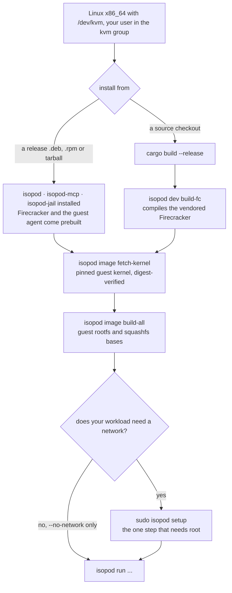
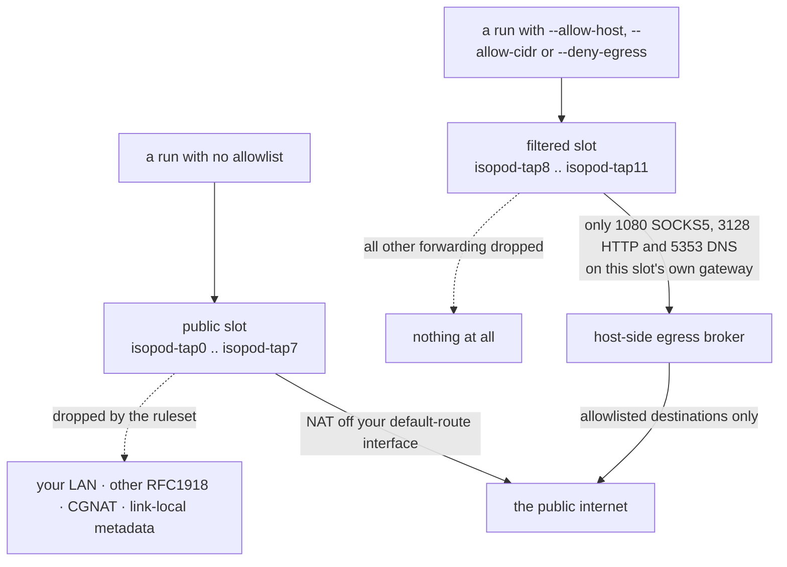
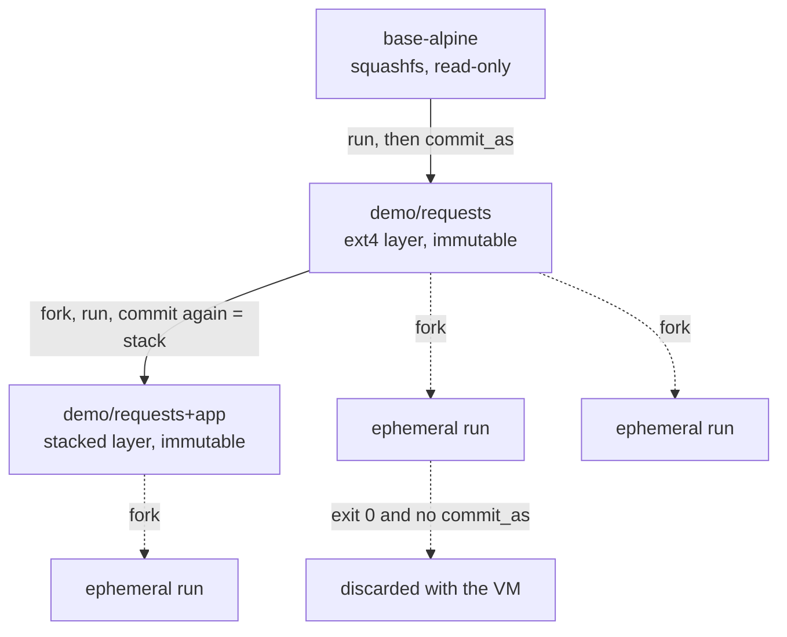
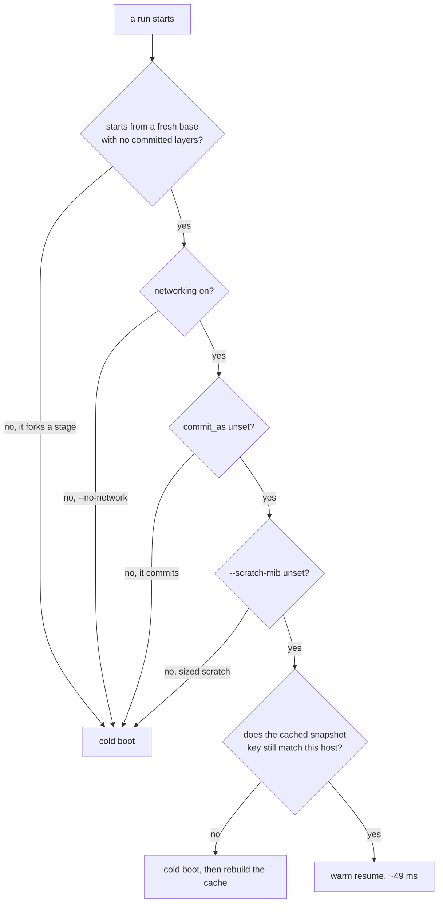

# Getting started

This is the full setup walk-through for isopod: prerequisites, building, guest
images, host networking, first runs, the warm pool, the optional jail, and
registering the MCP server for Claude Code. The [README](../README.md) quick
start is the condensed version of this document.

Everything below is written for a normal, unprivileged user account. Exactly
one step (`isopod setup`) needs root, once.

The whole path, and the two places it branches — a package install skips the
Firecracker build (§2a vs §2b), and a `--no-network`-only setup skips the root
step (§4):



## 1. Prerequisites

**Hardware / kernel:**

- Linux on **x86_64** (aarch64 is not supported yet) with KVM: `/dev/kvm`
  must exist and be usable by your user.

  ```bash
  ls -l /dev/kvm                 # should exist
  sudo usermod -aG kvm "$USER"   # then log out and back in
  ```

- Inside a VM (cloud instance, VMware, WSL2) you need **nested
  virtualization**. WSL2 on Windows 11 has it enabled by default; isopod is
  developed and tested on both WSL2 and bare-metal Linux.

**Toolchain and host packages:**

- **Rust** via [rustup](https://rustup.rs/). The exact toolchain (stable, plus
  the `x86_64-unknown-linux-musl` target for the guest agent) is pinned by
  [`rust-toolchain.toml`](../rust-toolchain.toml) and installed automatically
  the first time you run `cargo` in the checkout.
- Host tools — on Debian/Ubuntu:

  ```bash
  sudo apt install nftables iproute2 e2fsprogs squashfs-tools build-essential
  ```

  (`nftables`/`iproute2` for networking, `mkfs.ext4`/`resize2fs` for stage
  images, `mksquashfs` for base images, a C toolchain to build Firecracker.)

**Footprint:** expect a few GiB of disk for the build tree (`target/`,
vendored Firecracker) and low single-digit GiB under `~/.isopod` for the
Firecracker binary, kernel, and images (`base-alpine` is ~150 MiB; committed
stages and warm-pool snapshots add what you put in them). Each running VM
takes 512 MiB of RAM by default (`--mem-mib` to change).

## 2. Install a package — or build the workspace

### 2a. From a release package (recommended)

Every release on the [releases page](https://github.com/me1iissa/isopod/releases)
ships a `.deb`, an `.rpm`, and a plain tarball for x86_64 Linux, with
checksums in `SHA256SUMS`:

```bash
sudo apt install ./isopod_*_amd64.deb     # Debian/Ubuntu
sudo dnf install ./isopod-*.x86_64.rpm    # Fedora/RHEL-family
```

The package installs `isopod`, `isopod-mcp`, and `isopod-jail` into
`/usr/bin`, plus **prebuilt Firecracker and guest-agent binaries** under
`/usr/lib/isopod/` — so you skip the Rust toolchain, the submodule, and the
`dev build-fc` step entirely. Continue at §3 (you still build guest images
and run `setup`; `image fetch-kernel` + `image build-all` + `sudo isopod
setup` is your whole remaining path). A source build in your home directory,
if you later make one, takes precedence over the packaged Firecracker.

The tarball is the same content in a directory (`isopod-<ver>-x86_64-linux/`
with the three binaries at top level and `lib/` holding Firecracker + the
guest agent) for hosts without a package manager; put the binaries on your
`PATH` and set `ISOPOD_FC_BIN` and `ISOPOD_GUEST_AGENT_BIN` to the two
`lib/` files.

### 2b. From source

```bash
git clone https://github.com/me1iissa/isopod.git
cd isopod
git submodule update --init --recursive   # vendored Firecracker v1.16.1 source
cargo build --release
```

This produces three binaries under `target/release/`:

| Binary | Role |
|---|---|
| `isopod` | The CLI. |
| `isopod-mcp` | The MCP server Claude Code spawns over stdio. |
| `isopod-jail` | The rootless jail helper (only used when the jail is enabled). |

Optionally put the CLI on your `PATH` — a user-writable location is enough,
no root needed:

```bash
install -m755 target/release/isopod ~/.local/bin/isopod
```

The rest of this doc writes `isopod` for brevity; substitute
`./target/release/isopod` if you skipped the install.

> **sudo note:** `sudo isopod setup` will usually fail with "command not
> found" because sudo's `secure_path` does not include user directories. Use
> an explicit path: `sudo ~/.local/bin/isopod setup` or
> `sudo ./target/release/isopod setup`.

## 3. Build Firecracker and the guest images

All of this is unprivileged and idempotent. Artifacts land under `~/.isopod/`,
and each command prints a JSON object on success telling you what it produced.

**Package installs skip `dev build-fc`** — the packaged Firecracker at
`/usr/lib/isopod/firecracker` is found automatically. Start at
`fetch-kernel`.

```bash
# (Source builds only.) Compile the vendored Firecracker v1.16.1 and install
# it to ~/.isopod/bin. This is the slowest step (a full Rust release build —
# typically a few minutes). Verify: ~/.isopod/bin/firecracker --version
isopod dev build-fc

# Download the pinned guest kernel — a few tens of MiB from Firecracker's
# public CI artifact store, verified against a vendored sha256 digest.
isopod image fetch-kernel

# Build every guest rootfs image (dev images + the squashfs bases).
# Needs network: base-alpine fetches its packages from the Alpine CDN.
isopod image build-all

# Inspect what you have; images are stamped with the RPC protocol version.
isopod image ls
```

The guest kernel is pinned by exact artifact and digest — `fetch-kernel`
refuses anything that does not match. (`--allow-unpinned` exists solely for
maintainers discovering the digest of a new kernel before pinning it.)

Everything built? `isopod dev boot` boots a throwaway VM with no networking
and reports its boot latency — a good end-to-end smoke test before touching
the root step below.

If you later see a **protocol mismatch** error (host and guest images
disagreeing on the RPC version after an update), rebuild all images together:
`isopod image build-all`.

## 4. Host networking (the one root step)

```bash
sudo isopod setup
```

This provisions, once:

- **12 network slots** — tap devices `isopod-tap0..11`, owned by your user, so
  no privilege is needed at runtime (`--slots N` for more). The pool is split:
  - **8 public slots** — ordinary NAT egress to the public internet;
  - **4 filtered slots** — used by runs with an egress allowlist (§5.1). They
    forward *nothing*; their only reachable peer is a host-side broker.
    `--filtered-slots M` changes the split; `--filtered-slots 0` provisions
    none and reproduces the pre-0.9 ruleset exactly.
- an **nftables table** doing NAT off your default-route interface
  (`--iface` to override) with guest→guest and guest→LAN blocking;
- an **IP-forwarding sysctl** drop-in.

Which pool a run lands in, and what each pool can actually reach:



Each slot is its own `/30`. For slot *i* the host holds `10.107.<i>.1` on
`isopod-tap<i>` and the guest gets `10.107.<i>.2` — the address a run reports
back as `guest_ip`. Every tap is pinned to its own source address, so one slot
cannot spoof another.

Three things worth knowing:

- **Egress is public-only by default.** `--allow-lan-egress` disables the
  private-destination filter drawn above — it is explicitly insecure and exists
  for trusted-workload setups that need to reach LAN services.
- **The two pools never compete.** If the filtered pool is busy, a run asking
  for an allowlist waits for a filtered slot rather than quietly falling back to
  unfiltered egress.
- **Tap devices do not survive a reboot** (the sysctl does). If runs fail
  with a networking error after a host reboot — or a WSL2 shutdown — just
  re-run `sudo isopod setup`; it is idempotent.

Verify it worked: `ip link | grep isopod-tap` should list the taps
(`isopod-tap0` … `isopod-tap11`). If `setup` itself fails, the usual causes
are `nft` missing (install `nftables`) or no default route to NAT off
(pass `--iface <your-egress-interface>` explicitly).

**Upgrading from 0.8.x?** An existing `slots.json` keeps working untouched and
all your slots stay public. The first run that asks for an allowlist fails
before boot and prints the exact command to re-provision — nothing changes
underneath you until you run it.

`sudo isopod setup --remove` tears everything back down (taps, nftables
table, sysctl file).

If you only ever run with `--no-network`, you can skip this section: exec
works over vsock regardless of networking.

## 5. First runs

```bash
# Ephemeral: boot ~0.4 s, exec, destroy. Output is one JSON object on stdout.
isopod run --stage base --base base-alpine -- python3 -c 'print(6*7)'

# Untrusted code: no NIC at all.
isopod run --no-network --stage base --base base-alpine -- python3 suspicious.py

# Untrusted code that still needs one dependency source: default-deny egress.
isopod run --allow-host pypi.org --allow-host '*.pythonhosted.org' \
  --stage base --base base-alpine -- pip install requests

# Pull just the fields you care about.
isopod run --stage base --base base-alpine -- uname -a | jq '{exit_code, stdout}'
```

A successful run prints one JSON object (host paths yours, of course):

```json
{"ok":true,"vm_id":"dev-3d39a8fd","name":"fallen-thunderlord",
 "exit_code":0,"signal":null,"timed_out":false,
 "stdout":"42\n","stderr":"","stdout_truncated":false,"stderr_truncated":false,
 "stdout_bytes":3,"stderr_bytes":0,"exec_ms":139,"total_ms":483,
 "path":"warm","resume_ms":160,"snapshot_built":false,
 "vcpus":1,"mem_mib":512,"rootfs_flavor":"base-alpine",
 "fc_binary":{"path":"/home/you/.isopod/bin/firecracker","provenance":"vendored-build"},
 "serial_log_path":"/home/you/.isopod/vms/dev-3d39a8fd/console.log",
 "stdout_log_path":"/home/you/.isopod/vms/dev-3d39a8fd/exec-stdout.log",
 "stderr_log_path":"/home/you/.isopod/vms/dev-3d39a8fd/exec-stderr.log",
 "slot":0,"guest_ip":"10.107.0.2"}
```

The fields you'll look at most: `exit_code` + `stdout` (your command's
result), `path` (`"warm"` = snapshot resume, `"cold"` = full boot), and the
`*_log_path`s (the full, uncapped output when `stdout_truncated` is true).

### 5.1 Filtered egress — the allowlist the guest cannot rewrite

`--allow-host` (repeatable) switches a run to **default-deny** egress. It
claims a filtered slot, which the nftables ruleset drops all forwarding from,
and reaches the network only through a broker running on the host — outside the
sandbox, where no code in the guest can address it.

```bash
isopod run --allow-host pypi.org -- python3 -c \
  "import urllib.request; print(urllib.request.urlopen('https://pypi.org/simple/').read(40))"
```

- `--allow-host pypi.org` — an exact name.
- `--allow-host '*.pythonhosted.org'` — one wildcard label. It matches
  `files.pythonhosted.org` but **not** the apex `pythonhosted.org` and not
  `a.b.pythonhosted.org`. Quote it, or your shell will glob it.
- `--allow-cidr 192.0.2.0/24` — for tools that dial an address rather than a
  name. A literal address is never matched against `--allow-host` patterns.
- `--deny-egress` — deny everything, but still record every attempt. This is
  the one to reach for when you want to *find out* what a dependency contacts.

Every run in this mode returns an `egress` block:

```json
"egress": {
  "mode": "filtered",
  "allowed_rules": ["pypi.org", "*.pythonhosted.org"],
  "allowed": [{"host": "pypi.org", "port": 443, "ts_ms": 521}],
  "denied": [
    {"host": "example.com", "port": 443, "reason": "not_allowed", "ts_ms": 554},
    {"host": "exfil.evil.example.com", "port": 0, "reason": "not_allowed", "ts_ms": 556}
  ],
  "dns_queries": ["exfil.evil.example.com"],
  "total_events": 4, "truncated": false,
  "egress_log_path": "/home/you/.isopod/vms/dev-b806c77a/egress.jsonl"
}
```

A `denied` entry with `"port": 0` is a **DNS lookup** that was refused — the
guest has no route to any resolver but the broker, so a name you did not allow
cannot even be resolved, let alone contacted. The lists are capped at 64
entries inline (`truncated` tells you when that bit); the complete record is
JSON Lines at `egress_log_path`.

Filtered runs stay warm-pool eligible, so this costs a normal warm resume
(~74 ms measured), not a cold boot.

**Common surprises:**

- *"No filtered-egress slots"* — the host was provisioned before 0.9, or with
  `--filtered-slots 0`. The error prints the exact `sudo isopod setup` line.
- *`--no-network` with an allowlist is a hard error.* No NIC and a filtered NIC
  are different modes; isopod refuses to guess.
- *A tool reports a network error rather than a policy denial.* Anything that
  reads neither the `*_PROXY` environment nor `getaddrinfo` never reaches the
  broker, so the packet filter simply drops it. Busybox `wget` built without
  TLS is the common case: it sends `GET https://…` to the proxy instead of
  `CONNECT`, and gets a `501` that says so. Use a proxy-aware client (curl,
  python, pip, npm, git all work) — the recorded `note` field names the cause.

What this does **not** do: allowlisting is destination control, not data-loss
prevention. If you allow `github.com`, data can leave to `github.com`.
[SECURITY.md](../SECURITY.md) states the full set of claims and non-claims.

`--stage base` starts from a fresh squashfs base image with zero committed
layers. Two bases exist:

- **`base-alpine`** — python3/pip, node/npm, git, gcc, make. The one you want
  for real work, and the **MCP server's default**.
- **`base-sqfs`** — minimal busybox, no toolchain. For when you want the
  smallest possible surface — and the **CLI's default when `--base` is
  omitted**. If a stage run fails with `python3: not found`, this default is
  why: pass `--base base-alpine`.

(The CLI defaults to the minimal image; the MCP server defaults to the
toolchain image because agent workloads almost always want one.)

### Stages: build once, fork forever

```bash
# Install something and commit the filesystem delta as a stage (exit 0 only).
isopod run --stage base --base base-alpine --commit-as demo/requests -- pip install requests

# Fork it — the parent stage is never mutated, fork as often as you like.
isopod run --stage demo/requests -- python3 -c 'import requests; print("ok")'

# Inspect / prune.
isopod stage list
isopod stage info demo/requests
isopod stage rm demo/requests
```

Committing again on top of a forked stage **stacks** a new layer. Chains keep
one base flavor throughout; the chain depth limit is 10 layers.

Nothing above ever mutates a parent. A run assembles a fresh overlay from the
read-only base, the read-only stage layers, and its own scratch — so forks are
free to diverge and a stage can have as many children as you like:



Only a clean exit commits: a setup command that fails never leaves a broken
stage behind.

### Sizing a VM

| Flag | Default | Bounds |
|---|---|---|
| `--vcpus` | 1 | 1 or an even number, ≤ host CPUs |
| `--mem-mib` | 512 | 128 ≤ n ≤ host free RAM (with headroom) |
| `--scratch-mib` | ~1024 | 128 ≤ n ≤ 65536 — the writable overlay upper; sparse, so it costs little until written |
| `--timeout-s` | 120 | ≤ 3600 — **outer wall clock including boot**, not exec-only |

Over-cap requests fail fast with a clear message, before any VM boots.

### Moving data in and out

- `--stdin-file <path>` feeds the command's stdin from a host file (`-` for
  the CLI's own stdin) — the channel for tarballs and datasets.
- `--copy-out GUEST:HOST` (repeatable) streams guest files to host paths
  after a successful exec — the binary-safe artifact channel. Copies are
  attempted only when the command didn't time out; a failed copy fails the
  run. `HOST` is opened with `O_NOFOLLOW`: if it is a symlink the copy is
  refused rather than writing through it, so guest-authored bytes only ever
  land on the path you named. A symlinked *directory* in the path is fine.

## 6. Warm pool (optional, recommended)

The warm pool caches a full-VM snapshot of a booted-idle VM so eligible runs
resume in tens of milliseconds instead of cold-booting:

```bash
isopod warmpool build     # build (or reuse) the snapshot for the default config
isopod warmpool list      # see cached snapshots
isopod warmpool rm --all  # drop them (they rebuild on demand)
```

`warmpool build` is optional: the first eligible run builds the snapshot
automatically (paying the one-time cost, a few seconds, inside that run —
you'll see `snapshot_built: true` in its result). Prebuilding just moves that
cost off your first run.

Whether a given run resumes warm or cold-boots is decided here. This is the
canonical statement of the rules; other docs paraphrase it.



The key checked at the last step covers the Firecracker build, host kernel, CPU
model, base flavor, vCPUs, memory, and snapshot format. Change any one of them —
a kernel upgrade, a different `--mem-mib` — and the next run cold-boots once and
re-caches.

## 7. The rootless jail (optional second isolation layer)

For untrusted or multi-tenant workloads, wrap every Firecracker process in a
rootless microjail:

```bash
ISOPOD_JAIL=1 isopod run --stage base --base base-alpine -- id
```

Set `ISOPOD_JAIL=1` in the environment of whichever runtime you use (the CLI,
or the MCP server's environment). It adds user/pid namespaces (an escape
lands as an unprivileged unmapped uid, not your account), a minimal chroot
(your home and the rest of `~/.isopod` are not visible), and per-VM cgroup
memory/cpu/pids caps.

Requirements: unprivileged user namespaces, a delegated cgroup v2 subtree (a
normal systemd user session provides one), and `kvm` group membership. The
preflight **fails closed** with a specific message if something is missing —
it never silently runs unjailed. See [SECURITY.md](../SECURITY.md) for what
the jail does and does not defend against.

## 8. Claude Code: MCP server + skill

Register the MCP server at local scope (auto-trusted, no approval prompt):

```bash
cargo build --release -p isopod-mcp
claude mcp add --scope local isopod -- "$PWD/target/release/isopod-mcp"
claude mcp list    # -> isopod ... ✔ Connected
```

MCP servers load at session startup — **restart Claude Code** after
registering. Tools appear as `mcp__isopod__sandbox_run` etc., and the bundled
skill (`skill/SKILL.md`) teaches Claude the commit/fork workflow. Smoke-test
it by asking Claude to run `sandbox_run(cmd="echo hi")` — expect
`exit_code: 0` and `stdout: "hi\n"`.

Alternatively load the repo as a plugin (skill + server in one):

```bash
claude --plugin-dir /path/to/isopod
```

Full registration details, the tool list, and `sandbox_run`'s parameters:
[docs/mcp-usage.md](mcp-usage.md).

The MCP server is a stdio subprocess of Claude Code — after rebuilding
`isopod-mcp` you must restart the Claude Code session to pick the new binary
up.

## 9. Where state lives

Everything is under `~/.isopod`, file-locked for concurrent sessions:

| Path | Contents |
|---|---|
| `~/.isopod/bin/` | The Firecracker binary (and jail helper) `dev build-fc` installs. |
| `~/.isopod/images/` | Guest kernel + rootfs/base images, stamped with their protocol version. |
| `~/.isopod/stages/` | The content-addressed stage store (one directory per layer + `meta.json`). |
| `~/.isopod/vms/` | Per-run VM records: config, exec/serial logs, throwaway disks. |
| `~/.isopod/snapshots/` | Warm-pool snapshots, keyed by environment. |
| `~/.isopod/net/` | Network slot bookkeeping. |

Housekeeping: `isopod vm gc --keep-last 20` reaps orphaned Firecracker
processes and prunes old VM records (the MCP server also does this
automatically); `isopod stage rm` removes stages (leaf-first — removal is
refused while other stages fork from it); `isopod warmpool rm` drops
snapshot caches. Stages are never auto-pruned.

## 10. Troubleshooting

| Symptom | Cause / fix |
|---|---|
| `permission denied` opening `/dev/kvm` | Not in the `kvm` group (or no re-login since adding). `sudo usermod -aG kvm "$USER"`, log out/in. |
| `python3: not found` in a stage run (CLI) | The CLI's `--base` default is the toolchain-less `base-sqfs` — pass `--base base-alpine`. |
| Slot-exhaustion error on concurrent runs | All 8 **public** slots are claimed. Wait, run with `--no-network`, or re-provision with `sudo isopod setup --slots N`. |
| `no filtered-egress slots` on an `--allow-host` run | A *different* pool. Either the host predates 0.9 / was provisioned with `--filtered-slots 0`, or all 4 filtered slots are busy. The error prints the exact re-provisioning command; the two pools never borrow from each other. |
| Networking errors right after a host reboot / WSL restart | Taps don't survive reboots — re-run `sudo isopod setup` (idempotent). |
| `sudo: isopod: command not found` | sudo's `secure_path` skips user dirs — use `sudo ./target/release/isopod setup` or the full path. |
| Protocol-mismatch error naming host vs. image versions | Images built by an older checkout — `isopod image build-all`. |
| Degraded-overlay error on a stage run | Stale/corrupt guest image — `isopod image build-all`, then retry. |
| Jail preflight failure | Read its message: usually no delegated cgroup v2 subtree (run inside a normal systemd user session) or missing userns support. |
| A run hangs then times out at `--timeout-s` | That budget includes boot; raise it for slow commands. Check the serial log path in the JSON result for guest-side detail. |
| Host disk filling up | `isopod vm gc`, `isopod stage rm` unused stages, `isopod warmpool rm --all`. Logs are capped per-VM but retained until pruned. |

## 11. Uninstall

```bash
sudo isopod setup --remove   # taps, nftables table, sysctl drop-in
rm -rf ~/.isopod             # all images, stages, snapshots, VM records
rm -f ~/.local/bin/isopod    # the CLI, if you installed it
```

Plus `claude mcp remove isopod` if you registered the MCP server.
