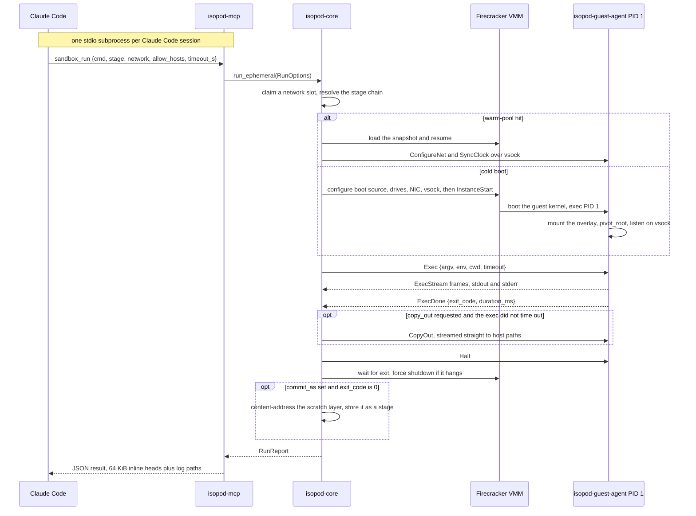
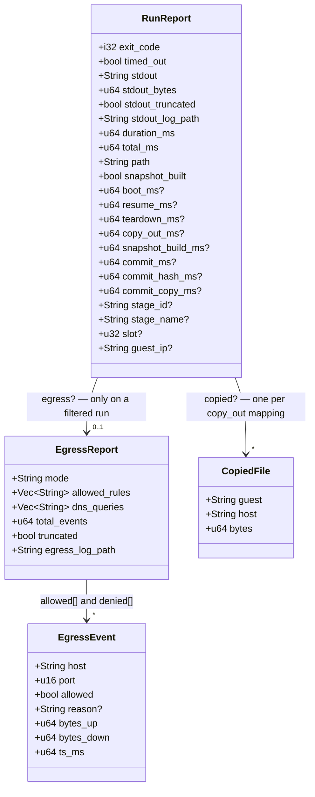
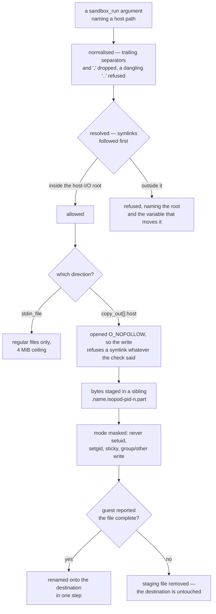

# Using isopod as an MCP server in Claude Code

isopod exposes its sandbox/stage/VM operations as MCP tools over stdio, via a
dedicated binary crate (`crates/mcp`, package `isopod-mcp`) built on rmcp 2.2.
This doc covers building the server, registering it two ways (project-scope
`.mcp.json` and the bundled plugin), the tool list, and a few end-to-end
example prompts.

**TL;DR:** for local development, use Option 1 (local-scope registration)
and skip ahead to the tool list.

## Build

If you installed a release package, the server is already at
`/usr/bin/isopod-mcp` — use that path in the registrations below and skip
the build. From a source checkout:

```bash
cargo build --release -p isopod-mcp
```

Produces `target/release/isopod-mcp`. It is a stdio server — Claude Code
spawns it as a subprocess per session; it is not a long-running daemon you
start yourself. All state (VM records, stages, network slots) lives under
`~/.isopod`, exactly as it does for the `isopod` CLI — the MCP server and the
CLI share `isopod-core` and read/write the same on-disk store.

Rebuild after any change under `crates/core` or `crates/mcp`; the CLI and the
MCP server are separate binaries built from a shared library, so a `cargo
build --release` for one does not update the other.

## Option 1: local-scope registration (recommended dev loop)

Register the built server with an absolute path at **local** scope — it is
auto-trusted (no approval prompt) and connects immediately:

```bash
cargo build --release -p isopod-mcp
claude mcp add --scope local isopod -- /absolute/path/to/isopod/target/release/isopod-mcp
claude mcp list      # -> isopod ... ✔ Connected
```

Tools appear as `mcp__isopod__<tool>`, e.g. `mcp__isopod__sandbox_run`.

**MCP servers load at Claude Code session startup**, so after registering you
must **restart Claude Code** (or reconnect) for the tools to appear in a
running session — registering mid-session does not hot-load them.

The repo deliberately does **not** commit a project-scope `.mcp.json`:
committing one forces an approval prompt on every user and conflicts with a
local registration of the same name. For distribution, use the bundled plugin
(Option 2), which carries the server config in its manifest. If you do want a
project-scope `.mcp.json` (VCS-shared, prompts once for approval), the shape
is `{"mcpServers":{"isopod":{"command":"${CLAUDE_PROJECT_DIR:-.}/target/release/isopod-mcp","args":[]}}}`
— but pick either that or the local registration, never both.

## Option 2: as a Claude Code plugin

`.claude-plugin/plugin.json` at the repo root bundles both the skill
(`skill/SKILL.md`) and the MCP server:

```json
{
  "name": "isopod",
  "...": "...",
  "skills": ["./skill"],
  "mcpServers": {
    "isopod": {
      "command": "${CLAUDE_PLUGIN_ROOT}/target/release/isopod-mcp",
      "args": []
    }
  }
}
```

`${CLAUDE_PLUGIN_ROOT}` always resolves to wherever the plugin is actually
loaded from, which is what makes this form work for local dev: load the repo
in place with

```bash
claude --plugin-dir /absolute/path/to/isopod
```

and the server command resolves to that same checkout's freshly-built
binary — no separate install/copy step, no stale binary after a rebuild.

This intentionally differs from the project-scope `.mcp.json` above (which
uses `${CLAUDE_PROJECT_DIR}` instead of `${CLAUDE_PLUGIN_ROOT}`): a
plugin-provided MCP config that used `${CLAUDE_PROJECT_DIR}` would resolve to
whatever project the *user* currently has open, not to the isopod checkout
itself, which breaks the moment someone uses the plugin while working on an
unrelated project. `${CLAUDE_PLUGIN_ROOT}` is the only form that is correct
in the plugin context, so the two registration paths carry two different
command strings.

Tools registered via the plugin appear scoped as
`mcp__plugin_isopod_isopod__<tool>` (the general plugin pattern is
`mcp__plugin_<plugin-name>_<server-name>__<tool>`; isopod uses the same name
for both, hence `isopod_isopod`).

Note on distribution: the plugin's `command` is a small launcher,
`${CLAUDE_PLUGIN_ROOT}/isopod-mcp`, which finds the server wherever isopod was
installed. It prefers a `target/release` build in the plugin root (so a dev
checkout loaded with `--plugin-dir` uses your own build), then `$ISOPOD_MCP_BIN`,
then `isopod-mcp` on `PATH`, then the usual install locations — which matters for
a client launched from a desktop environment that did not inherit your shell's
`PATH`. With none of them it exits non-zero and prints how to install isopod.

It resolves rather than vendors deliberately. Shipping a prebuilt `isopod-mcp`
inside the plugin would make the *server* start and change nothing else: a
sandbox still needs `/dev/kvm`, a Firecracker binary, guest images and one
`sudo isopod setup`. That plugin would connect cleanly and then fail on the
first `sandbox_run`, which is a worse failure than refusing at startup — it
arrives later and looks like a bug rather than a missing install.

## What one `sandbox_run` call does

Every call is a whole microVM: claimed, booted or resumed, exec'd, and destroyed
before the JSON comes back. Nothing survives the call except a stage you asked
for with `commit_as` and files you asked for with `copy_out`.



Two things follow from the order above. The commit happens **after** the VM is
gone, so a `commit_as` run's `total_ms` includes hashing the layer on top of
everything else. And `timeout_s` is spent from the top of the diagram — boot or
resume comes out of the same budget as `Exec`, not on top of it.

## Tool list

All tools wrap `isopod-core` functions directly — the MCP server adds no
behavior beyond argument marshaling and JSON shaping. Full param docs live in
each tool's MCP schema (self-describing); this is the one-line semantics.

| Tool | Semantics |
|---|---|
| `sandbox_run` | **The core tool.** Boot a VM, run `cmd` via `/bin/sh -c`, optionally commit the result as a stage, destroy the VM. Ephemeral by default — nothing persists unless `commit_as` is set and the command exits 0. |
| `stage_list` | List every committed stage (id, vanity name, label, parent, base, `base_sha256`, allocated bytes, created time). |
| `stage_info` | Full metadata plus the resolved layer chain for one stage (by id, vanity name, or unique label). |
| `stage_rm` | Remove a stage. Refuses if another stage's chain still forks from it. |
| `vm_list` | Recent VM records (id, vanity name, flavor, created, directory size) — useful for finding a vanity name after the fact. |
| `vm_gc` | Reap orphaned Firecracker processes and prune old VM record directories, keeping the newest `keep_last` (default 20). |
| `image_list` | Every base a run can boot: the built flavors and any imported OCI image, with staleness. Read-only — importing and removing images are CLI-only, so nothing a model asks for can pull bytes onto the host or take a base out from under a stage. |

### `sandbox_run` params (the one worth knowing in detail)

| Param | Default | Notes |
|---|---|---|
| `cmd` | — | Required. Run via `/bin/sh -c`, so pipes/redirects/`&&` all work. |
| `stage` | `"base"` | A committed stage's id/vanity-name/label to fork from, or the reserved word `"base"` for a fresh VM with zero committed layers on the toolchain image. |
| `base` | `"base-alpine"` | Squashfs base for a `stage="base"` run: `base-alpine` (python3/pip, node, git, gcc) or `base-sqfs` (minimal busybox, no toolchain). Ignored when forking an existing stage — forks always reuse the base that stage was built on. |
| `network` | `true` | Set `false` for untrusted code — no NIC is attached at all; exec still works (control RPC is vsock, not the network). |
| `allow_hosts` | — | **Default-deny egress.** Setting it — even to `[]` — switches the run to a *filtered* slot that forwards nothing, plus a host-side broker enforcing this list. Exact names (`"pypi.org"`) or one leading wildcard label (`"*.pythonhosted.org"`, which does **not** match the apex). `[]` denies everything while still recording what was attempted. Cannot be combined with `network=false`. Needs `sudo isopod setup --filtered-slots`. |
| `allow_cidrs` | — | Permit literal IP destinations (e.g. `["192.0.2.0/24"]`) for tools that dial an address rather than a name. Also switches the run to filtered egress. A literal address is never matched against `allow_hosts` patterns. |
| `timeout_s` | `120` | **Outer wall-clock budget that includes VM boot** (~0.4 s), not exec-only time. |
| `cwd` | guest default (`/root`) | Working directory inside the guest. |
| `env` | `{}` | Extra environment variables as a flat `KEY: "VALUE"` object. |
| `commit_as` | — | Label to persist the result as a new stage. Only commits when the command exits 0 — a failed setup command never silently produces a broken stage. |
| `stdin` | — | Small inline text piped to the command's stdin, then closed. |
| `stdin_file` | — | HOST-side file whose bytes are piped to stdin — use for anything beyond a few KiB so large payloads never transit the model context. Mutually exclusive with `stdin`. Confined to the server's host-I/O root, regular files only, 4 MiB ceiling — see [Host paths](#host-paths-stdin_file-and-copy_out) below. |
| `vcpus` | `1` | Guest vCPUs: 1 or an even number, at most the host CPU count. Over-cap errors before boot. |
| `mem_mib` | `512` | Guest memory in MiB, bounded 128..=host free RAM (with headroom). Over-cap errors before boot. |
| `scratch_mib` | ~`1024` | Writable overlay scratch in MiB (128..=65536, sparse). Raise for build workloads; passing it forces the cold (disk-upper) path. |
| `copy_out` | — | List of `{guest, host}` mappings: stream guest files to host paths after a successful exec — the binary-safe artifact channel. A copy failure fails the call; written files are listed in the result's `copied`. `host` is confined to the host-I/O root and the guest's file mode is masked — see [Host paths](#host-paths-stdin_file-and-copy_out) below. |

Forking checks the base *build*, not just the flavor, for every stage in the
chain rather than only the one named. Every stage records the
content id of the image it was made over (`base_sha256`); if the image has
*changed* since — `isopod image build-all` with a new guest agent, a
`PROTO_VERSION` bump, different packages — the fork is refused
before boot rather than mounting layers over a root they no longer match. A
rebuild that produces the same tree produces the same id and refuses nothing:
the pack is timestamp-pinned, so the clock is not part of the image. The
error names both content ids and both ways out. `ISOPOD_ALLOW_BASE_SKEW=1` in
the server's environment overrides it, for the commit as well as the boot — but
it is set by whoever launches `isopod-mcp`, not by a tool call, so a client that
hits this cannot lift it itself. Nor does it repair anything: a commit made under
it stacks on the same stale ancestors, so the stage it produces still disagrees
with the image and still needs the variable. Rebuilding the stage from
`stage: "base"` on the current image is what clears it. Stages committed before
isopod 0.12.0 record no content id and fork unchecked.

Return shape (abridged): `{exit_code, signal, timed_out, stdout, stderr,
stdout_truncated, stderr_truncated, stdout_bytes, stderr_bytes, duration_ms,
total_ms, path, boot_ms?, teardown_ms?, copy_out_ms?, snapshot_build_ms?,
resume_ms?, snapshot_built, commit_ms?, commit_hash_ms?, commit_copy_ms?,
vcpus, mem_mib, vm_id, vm_name, rootfs_flavor, stage_id?, stage_name?, slot?,
guest_ip?, stdout_log_path, stderr_log_path, serial_log_path, copied?,
egress?}`.

It is one flat object with two nested ones hanging off it. A `?` marks a field
that is only there under a condition — which condition is the useful part:



`stderr` mirrors every `stdout` field. `resume_ms` and `snapshot_built` track
`path` — `"warm"` means a snapshot resume, `"cold"` a full boot, and `boot_ms`
(InstanceStart → first agent ping) is the cold path's counterpart to
`resume_ms`. `teardown_ms` (halt → VMM exit → log drain) is on every completed
run; `copy_out_ms` only when `copy_out` streamed files; `snapshot_build_ms`
only beside `snapshot_built: true` — the one-time builder-VM cost inside that
run's `total_ms`. `stage_*` and `commit_ms` appear only when `commit_as`
actually committed, with `commit_hash_ms` (the BLAKE3 content pass) and
`commit_copy_ms` (the sparse layer copy) splitting where the commit time went;
`slot`/`guest_ip` only when networking was on.

The inline `stdout`/`stderr` are 64 KiB **heads**, with exact byte totals
alongside them and the complete streams on disk at the `*_log_path`s — those
on-disk logs have their own, much larger caps (see SECURITY.md).

### Host paths: `stdin_file` and `copy_out`

Every other `sandbox_run` argument describes work to do *inside* the VM. These two
do not — they name files on the machine running the server, and that machine is
not the sandbox. Since 0.11.0 both are confined:



The root defaults to **the server's working directory** — the project a coding
agent is working in, which is what artifact extraction and large stdin payloads
are for. Symlinks are resolved *before* the check, so a link the sandbox planted
inside the root cannot reach out of it.

A write destination is **normalised first**: trailing separators and `.`
components are dropped so that every guard sees the same final component the
kernel will. A `..` below the deepest existing directory is refused outright; any
other `..` is resolved against the existing prefix and then re-tested against the
root. That matters because it went wrong — the guard that refuses a dangling
symlink was skipped entirely by writing the link as `link/` rather than `link`,
since `symlink_metadata` on a path with a trailing separator reports `ENOTDIR`.
The write then opens the final component with `O_NOFOLLOW`, so it refuses to
traverse a symlink whatever the check concluded; a check and an open are two
lookups of one name, and only the syscall can close the gap. The same flag applies
to the `isopod` CLI's `--copy-out`, which now writes to the path you named or
fails, rather than through it to wherever it points — at the final component;
a symlink among the parent directories is still followed, which `SECURITY.md`
records as an explicit non-claim.

The bytes do not go to the destination directly. They are staged in a sibling
`.<name>.isopod-<pid>-<n>.part` and renamed onto it only once the guest reports
the file complete. A copy that fails partway — a missing guest source, a blown
ceiling, a guest that goes silent — leaves the destination byte-identical, where
it used to leave it truncated or deleted. A device or a reader-backed FIFO is
still written straight through, since renaming onto `/dev/null` would replace the
node with a regular file.

| Variable | Effect |
|---|---|
| `ISOPOD_MCP_HOST_IO_ROOT` | Confine to this directory instead of the cwd. `/` disables the confinement entirely, explicitly and visibly — the startup log says `UNCONFINED`. |
| `ISOPOD_MCP_HOST_IO=off` | Refuse both arguments outright. |
| `ISOPOD_MCP_STDIN_FILE=off` | Refuse `stdin_file` only. |
| `ISOPOD_MCP_COPY_OUT=off` | Refuse `copy_out` only. |

Set them in the `env` block of your MCP registration (see [Option 2](#option-2-as-a-claude-code-plugin)).
The server logs which policy is in force on startup, on stderr.

Why this is a policy and not just a caveat: unconfined, `stdin_file` was an
arbitrary host-file read whose contents come back in `stdout`, and `copy_out` was
an arbitrary host-file write with guest-authored bytes. Together they were enough
to read `~/.isopod/credentials.json`, read the `file:` sources it names, or rewrite
it. The `isopod` CLI is deliberately unaffected — there the caller is the operator,
who owns those files already.

**A root is not a sandbox.** Confining `copy_out` keeps it away from the credential
store; it does not make the files inside the root safe, and by default that root is
your source tree. Point `ISOPOD_MCP_HOST_IO_ROOT` somewhere disposable, or set
`ISOPOD_MCP_COPY_OUT=off`, if the sandbox writing there is not what you want.

### `egress` — the flight recorder

A filtered run returns `egress: {mode, allowed_rules, allowed[], denied[],
dns_queries[], total_events, truncated, egress_log_path}`. `allowed` and
`denied` list every connection the broker permitted and refused (with a
machine-readable `reason`), and `dns_queries` every name the workload asked to
resolve — including the ones that were refused, which is the signal that
something tried to phone home. Each list is capped at 64 entries inline with
`truncated` set; the complete record is JSON Lines at `egress_log_path`.

Host names in this structure come from untrusted guest code and are validated
before recording: anything that is not a well-formed host name appears as
`<invalid:N>` (the byte count, nothing else), so a malicious dependency cannot
inject text into your context through a destination name.

## Example prompts

**"Run this Python snippet in a sandbox and tell me the output."**
→ one `sandbox_run` call with `cmd` wrapping the snippet (e.g. via `python3
-c "..."` or by writing it with a heredoc inside `cmd`), default `stage`/
`base`/`network`. Ephemeral: nothing is left behind.

**"Set up a sandbox with numpy and pandas installed, then reuse it for the
rest of this session."**
→ `sandbox_run(cmd="pip install numpy pandas", commit_as="<project>/data-deps")`
(bare `pip install` works on `base-alpine` — the image ships with the
`EXTERNALLY-MANAGED` marker removed), then every subsequent
`sandbox_run(..., stage="<project>/data-deps")` in the same or a later
session forks that environment instead of reinstalling. Verify with
`stage_info(reference="<project>/data-deps")`.

**"Install this package but don't let anything else reach the network."**
→ `sandbox_run(cmd="pip install requests", allow_hosts=["pypi.org",
"*.pythonhosted.org"])`. Anything the install tries to reach beyond those two
fails closed and is listed in the result's `egress.denied`.

**"Run this dependency and show me what it tries to contact."**
→ `sandbox_run(cmd="node index.js", allow_hosts=[])` — everything is denied,
but every attempted connection and DNS lookup is recorded in `egress`.

**"Test this untrusted script without giving it network access, then clean
up."**
→ `sandbox_run(cmd="python3 script.py", network=false)`, followed by
`vm_gc()` (and `stage_rm(...)` if a stage was accidentally committed and
should be discarded).

## See also

- `skill/SKILL.md` — the workflow-level guidance loaded into Claude's context
  (ephemeral-first, commit/fork discipline, naming, when to disable
  networking). This doc is the registration/reference companion to it.
- `docs/dogfood-findings.md` (#9) — the `timeout_s`-includes-boot behavior
  was found and documented via dogfooding the CLI before the MCP tool
  existed; the semantics carry over unchanged.
- `PLAN.md` — "MCP server (`isopod mcp`) + skill" section for the full
  design rationale (output truncation policy, progress-notification
  keepalive, the reasoning for no persistent-session tools in v1).
