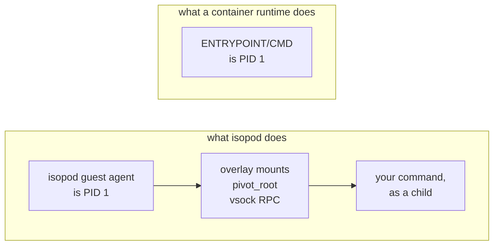
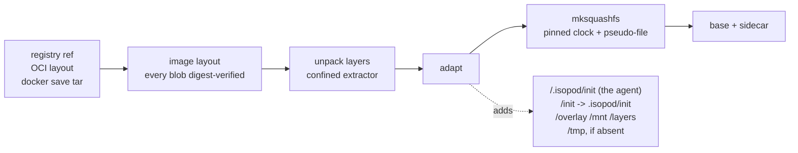

# Importing an OCI image

`isopod image import` turns a container image into a bootable isopod base. Pull
it from a registry, read it from a local layout, or read it from a `docker save`
tarball — all three land in the same place.

```
isopod image import alpine:3.20
isopod image import --oci-layout ./layout --name my-base
isopod image import --docker-save ./saved.tar --name my-base

isopod image ls                      # built flavors and imported images, one list
isopod image rm alpine-3.20          # or `oci:alpine-3.20`; both spell the same image
```

## What you get, and what you do not

**isopod runs your image's filesystem, with isopod's init.** That sentence is
the whole contract, and the difference between it and "isopod runs your
container" is not a detail.



PID 1 is the agent that mounts the overlay chain, pivots into it and serves the
RPC that a run is made of. An image's `ENTRYPOINT` cannot be PID 1 without
taking that job away, so:

| Image config | What isopod does with it |
|---|---|
| `Env` | merged **under** the run's own environment — the run wins |
| `WorkingDir` | the run's default working directory |
| `Entrypoint` | recorded, **never executed** |
| `Cmd` | recorded, **never executed** |
| `User` | **ignored** — the agent execs as root |

The ones that are *ignored* rather than merely unused are printed by the import
command itself. Nobody reads documentation for the thing that silently did not
happen.

**An image with no `/bin/sh` is refused**, by name, at import time. The exec
surface is `/bin/sh -c <command>`, so a distroless or scratch-based image cannot
run anything; the alternative to refusing is an exit 127 inside a VM long after
the import looked like it worked.

## Using an imported base

An imported base is spelled `oci:<name>` wherever a base is named:

```bash
isopod image import alpine:3.20
isopod run --stage base --base oci:alpine-3.20 -- /bin/sh -c 'cat /etc/alpine-release'
isopod run --stage base --base oci:alpine-3.20 --commit-as myproj/deps -- apk add curl
isopod run --stage myproj/deps -- curl --version     # the recorded base boots
```

The prefix is not decoration. A bare name would collide with the built-in flavor
slugs the moment somebody imported an image called `base-alpine`, and "which one
did it boot?" is not a question to have about a root filesystem.

A stage records the base it was built on, so a fork boots that base and ignores
`--base` — the layers were made over that root, and merging them onto a
different one succeeds silently and wrongly.

The image's `Env` and `WorkingDir` are applied as defaults on every run that
boots the base, **including a fork**, taken from the base the run actually
resolved rather than from what was typed. Without that a `python:3.12` base does
not find `python` on `PATH`.

## Listing and removing

`isopod image ls` lists imported images beside the built-in flavors, in **one**
list, because "what can I pass to `--base`?" is one question: a flavor slug and
an `oci:<name>` are the same namespace, a stage records whichever it booted in
one string, and the refusal for an unknown base points here. Each row carries
its `kind` (`builtin` or `imported`), whether it is on disk, its size, its
`source_ref`, and the same freshness verdict a built flavor gets — which matters
more for an imported base, since an agent rebuild retires every one of them.

Over MCP the same list is the `image_list` tool. That is the only image surface a
model gets: importing and removing are CLI operations, so nothing a model asks
for can bring bytes onto the host or take a base away from a stage.

```bash
isopod image rm alpine-3.20            # refused while a stage records it
isopod image rm alpine-3.20 --force    # removed anyway; those stages stop booting
```

A stage's layers are overlay upperdirs over one specific root, so a stage that
recorded this base is a stage that cannot boot without it. The refusal names the
stages rather than saying "in use", and `--force` reports which ones it broke.
The image and its sidecar go together; the **cached layer blobs stay**, so a
re-import is still local — the outcome names the directory to delete if you want
those bytes back.

## What the import actually changes

Deliberately little. Every byte of it is a difference between the image you
asked for and the image you get.



The image's own `/sbin/init` is left alone — on a Debian-derived image that is
systemd, and the kernel boots `init=/init`, so `/init` is the only path isopod
has to own. An image that ships its own `/init` has it replaced, and the sidecar
records that it did.

`/layers` is created **empty**. It is a mountpoint for a tmpfs the guest creates
layer directories on; preallocating them is what once capped a stage chain at
nine layers.

## setuid bits live in the image, never on your disk

A base image carries setuid binaries — `ping`, `su`, `sudo`. Stripping them
would break those tools; writing them to the host as it unpacks would drop
attacker-authored setuid files into your home directory before any VM exists.

So the extractor **records** them and never writes them, and the pack applies
them inside the squashfs through a `mksquashfs` pseudo-file. Inside the guest
everything is root already, so the bits grant nothing there — they exist to keep
the image's own tools working.

Two things about that are worth knowing, because both are load-bearing:

- Every path in the pseudo-file is quoted and escaped. The format is
  space-delimited with a *type* field in second position, so a tar entry named
  `evil c 0666 0 0 1 3` would otherwise render a line that reads "create a
  character device" — the one thing the extractor refuses to do.
- `mksquashfs` **silently ignores** a pseudo-file line naming a path it cannot
  find, and exits 0 while doing it. So the import counts what came out of the
  image against what went in, rather than treating a clean exit as evidence.

A bit only survives if the finished tree still carries it. An image whose author
ran `chmod -s` on a binary, or deleted it in a later layer, does not get it back.

## Re-importing is cheap, and you will need to

The sidecar records the reference, the resolved platform, the manifest and
config digests and every layer digest, and layer blobs are cached under
`~/.isopod/images/oci-blobs/<readable-prefix>-<hash of the reference>`. A
re-import of the same reference is a local operation.

The key is a hash of the whole reference, not of its readable form, and the
distinction is load-bearing. A cache directory is an OCI image layout: the blobs
in it are content-addressed and two references may safely share them, but its
one `index.json` is rewritten by every pull and read straight back. Keyed by the
shell-safe name alone, `a/b:c` and `a-b-c` — or `ghcr.io/org/app:v1` and
`ghcr.io/org/app/v1` — name the same directory, so two imports running at once
can each read the other's index and pack an image from the wrong manifest, with
every blob verifying and the sidecar recording the reference that was asked for.
Digests answer "are these the bytes that were named"; the key has to answer
"whose layout is this".

That matters more than it sounds. An imported base is stamped with the
guest-agent hash it was built against, and **every guest-agent rebuild
invalidates every imported base** — the freshness check compares that hash, not
only the protocol version, and agent hashes change far more often.

Importing the same image twice gives the same content id, on the same host with
the same squashfs-tools: the pack pins its clock and the extractor sets modes
explicitly rather than letting your umask choose them. Across squashfs-tools
versions that is not guaranteed, so re-derivability is the promise and
byte-identity is a property.

## What it costs

Measured, not estimated — the full table is in
[BENCHMARKS.md](../BENCHMARKS.md#built-base-vs-imported-oci-image).

| | |
|---|---|
| Import `alpine:3.20` (1 layer) | 1.7 s cold, 1.0 s with blobs cached |
| Import `python:3.12-alpine` (4 layers) | 3.5 s cold, 2.4 s cached |
| Boot, imported vs built | indistinguishable at 30 samples |
| Warm resume | 43–50 ms regardless of base or image size |

The snapshot restore does not care what the base is. What does move boot time is
what is *in* the image: a 150 MB toolchain base costs ~80 ms more on a warm run
than a 4 MB one, nearly all of it in the exec rather than the resume.

## Limits

| | |
|---|---|
| Platform | `linux/amd64` only — Firecracker on x86-64 |
| Compression | gzip and uncompressed layers; zstd is refused by name |
| `docker save` | the **OCI** archive format. A legacy archive (top-level `manifest.json` naming `<hash>/layer.tar`) is refused with the conversion command |
| Foreign layers | refused — their bytes are not in the image at all |
| Registry auth | `~/.docker/config.json`, never isopod's credential store. That store's design is "the run names an alias and never holds the secret"; registry auth is the *host* authenticating with no guest involved |
