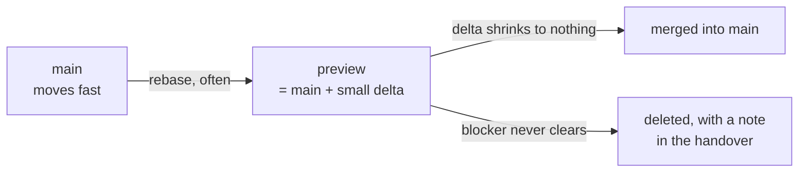

# The `preview` branch

Where experiments that cannot live on `main` are kept honest.

`main` is the supported line: everything on it builds, passes its tests, and
depends only on released crates. Some work cannot meet that bar yet and is still
worth doing — a pre-release SDK, a protocol revision no client implements yet, a
design that needs to be felt before it is judged. `preview` is for exactly that,
and for nothing else.

## What belongs here

Work that is blocked on something outside the project:

- A **pre-release dependency**. A major-version bump cannot be dual-pinned
  cleanly, so it needs its own line.
- A capability that needs **client support that does not exist yet**, where the
  only way to find out is to build it and try.
- A design worth **holding at arm's length** until it has been used.

## What does not

**Anything that could be a cargo feature on `main` should be a cargo feature on
`main`.** A feature stays compiled, stays under CI, and cannot rot. A branch can
do all three of those things wrong. Reach for `preview` only when the thing that
blocks you is a dependency version or an external implementation — not when it is
merely unfinished.

Unfinished work belongs on `main` behind a flag, or nowhere.

## The rules

**1. Rebase onto `main`. Never merge into it.**
`preview` is always "`main` plus a delta you can read in one sitting". `main`
has moved by a dozen commits in a single session before now; a merge-based
branch stops being mergeable within days. Rebase often enough that the conflicts
are boring.

**2. It must build and pass its tests.**
`preview` is in CI (`.github/workflows/ci.yml` covers it). A red preview branch
is a branch nobody trusts, and a branch nobody trusts is one nobody rebases —
after which it is just a slow deletion. If a pre-release dependency makes green
impossible, say so at the top of this file and fix a date to re-check.

**3. Its version says what it is.**
The workspace `Cargo.toml` and `.claude-plugin/plugin.json` carry
`X.Y.Z-preview.N`, in lockstep, as they do for a release. Both binaries install
to the same `~/.local/bin/isopod`, so `isopod --version` is the only thing
standing between "the preview build" and "the release build" on a machine that
has run both. A preview build that reports a release version is a support
problem waiting to happen.

**4. Every experiment has exit criteria, written when it starts.**
Below, in the table. Two of them: what merges it, and what kills it. An
experiment with no kill condition is not an experiment.

**5. It is never released from.**
No tags, no packages, no `main`-equivalent claims. `preview` is a place to learn
something, and what gets merged is the conclusion — usually much smaller than
what was written to reach it.

## Current experiments

| Experiment | Why it cannot be on `main` | Merges when | Dies if |
|---|---|---|---|
| *(none yet)* | | | |

## When an experiment ends

Merging: rebase, shrink the delta to the part that earned its place, and open it
as an ordinary change against `main` — with the same tests, mutations and
documentation any other change gets. Nothing merges *because* it was on
`preview`.

Deleting: delete the branch and write one paragraph in the handover saying what
was learned. A dead experiment that taught you the answer is a success; an
undeleted one that taught you the answer is debt.
