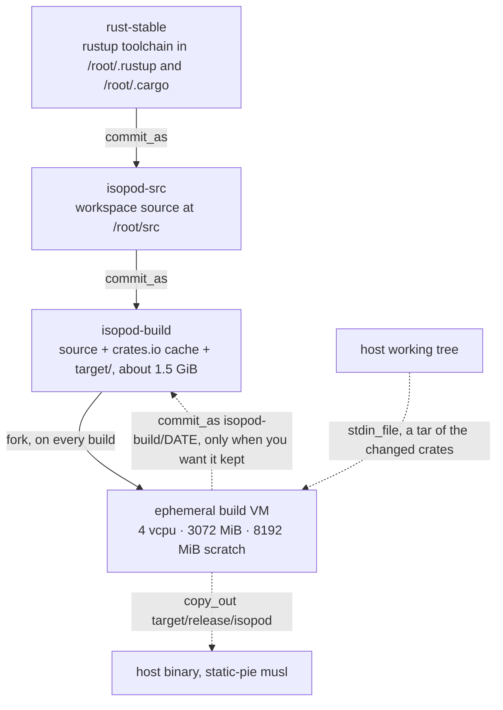

# Building isopod inside isopod

isopod's builds run inside its own sandboxes — dogfooding the stage model with the
heaviest workload we have, and keeping toolchains and build state off the host. Proven
end-to-end over the MCP server on 2026-07-22 (see `docs/dogfood-findings.md`, MCP v2
gauntlet section).

## Stage chain

| stage | contents | rebuild trigger |
|---|---|---|
| `rust-stable` | rustup stable x86_64-unknown-linux-musl under `/root/.rustup` + `/root/.cargo` | toolchain bump |
| `isopod-src` | workspace source at `/root/src` on top of `rust-stable` | source refresh |
| `isopod-build` | source + crates.io cache + `target/` (≈1.5 GiB layer) | after a clean build |

The chain is built once; every build after that forks the **newest**
`isopod-build/*` stage and throws the VM away. Fork the newest, not the bare
`isopod-build` label: that one was committed before the current dependency set
and an offline build on it fails to resolve a crate that is in the lockfile but
not in its cache (`docs/dogfood-findings.md` #50). `stage_list` — or `isopod
stage ls` — is how you find the newest. Source goes in over stdin, binaries come
out over `copy_out`, and the stage is only re-committed when you want the
refreshed `target/` kept:



Every build cmd starts with:

```sh
export RUSTUP_HOME=/root/.rustup CARGO_HOME=/root/.cargo PATH=/root/.cargo/bin:$PATH
cd /root/src
```

## Getting source in

For uncommitted local changes — or a guest without network access — use `stdin_file` (a host
path — works on both the CLI `--stdin-file` and, since the #21 fix, the MCP `sandbox_run`
param) rather than inline MCP `stdin`, which would transit the payload through model context:

Send the tarball **raw**. The channel is binary-safe on both surfaces — bytes are
base64'd inside the protocol frame either way, so encoding them yourself first only
inflates the payload by a third:

```sh
tar czf - Cargo.toml Cargo.lock rust-toolchain.toml crates > /tmp/src.tgz
isopod run --stage isopod-build/0.12.0-tested --scratch-mib 8192 --stdin-file /tmp/src.tgz -- \
  /bin/sh -c 'tar xzf - -C /root/src && cd /root/src && \
    export RUSTUP_HOME=/root/.rustup CARGO_HOME=/root/.cargo PATH=/root/.cargo/bin:$PATH && \
    cargo build --workspace'
```

**There is a ceiling, and it is low.** `PutFile` is one frame, capped at
`MAX_FRAME_LEN` (8 MiB) *after* base64 — so about **6 MiB of raw input**, or 4.5 MiB
if you encode it yourself as well. The MCP surface refuses at 4 MiB before booting
and names the limit; the CLI does not check, so it boots a VM and then fails with
the post-encoding byte count. isopod's own workspace source is ~540 KiB and fits
comfortably; a repo with its `.git` does not. Nothing larger gets in without the
network — `copy_out` is streamed and unbounded, but there is no inbound equivalent
(`docs/dogfood-findings.md` #46).

Untarring over `/root/src` updates only changed files' mtimes, so cargo rebuilds just the
touched crates (measured: 6.93 s after touching `crates/cli/src/main.rs`, vs 2 m 06 s clean).
To persist the refreshed state, add `--commit-as isopod-build/<date>` (label-reuse semantics
for an existing label are untested — use versioned labels until that's gauntleted).

For committed state, `git clone`/`git pull` in-guest from the remote replaces the tarball
dance (a private repo needs a read token supplied to the guest), and is the only route
for anything over the ceiling.

## Everyday check/test loop (MCP)

For Claude sessions: `sandbox_run` with `stage: "isopod-build/0.12.0-tested"`, `vcpus: 4`, `mem_mib: 3072`,
`scratch_mib: 8192`, `timeout_s: 300` (600 for clean builds; commit adds ≈20 s/GiB). Run
`cargo build`/`cargo check`/`cargo test` as needed — since coreutils landed in base-alpine,
**the full workspace test suite passes in-guest (132/132 core)**. Only tests needing
`/dev/kvm` or live host state (taps, a real `~/.isopod`) stay on the host (they are
`#[ignore]`d live tests anyway).

## Running the mutation harness in-guest

`scripts/mutation-check.py` is destructive by design — it edits source to prove the
suite notices — so a sandbox is where it belongs, and the host tree never has to be
trusted back. It works from `git archive HEAD`, so the overlaid source needs a repo:

```sh
cd /root/src
git init -q .
printf 'target/\n.git/\n' > .git/info/exclude   # ← the trap; see below
git config user.email t@t.invalid && git config user.name t
git add -A && git commit -qm 'tree under test'
python3 scripts/mutation-check.py --only <mutation-name>
```

**`target/` must be excluded before `git add -A`, and nothing in the tarball does it
for you.** The stage already carries the previous build's `target/` (≈1.5 GiB) at
`/root/src/target`, and a source tarball built from `Cargo.toml Cargo.lock crates
scripts` contains no `.gitignore` — so `git add -A` sweeps all of it into the index and
`git archive HEAD` then tries to export it. What that looks like is a VM killed by the
OOM reaper seconds after `exporting HEAD to …`, with no other diagnostic, which reads
like a memory shortage and is not one: it survives unchanged at the host's memory cap
and disappears entirely once `target/` is excluded. The check that tells them apart is
`git ls-files | wc -l` — the workspace is ~94 files.

One mutation runs in ~2.5 min at 4 vcpu / 3072 MiB / 16384 MiB scratch, most of it the
cold `warming the build cache` pass over the exported tree.

## Getting binaries out

Use `--copy-out GUEST:HOST` (CLI) or `copy_out: [{guest, host}]` (MCP) — the streamed,
binary-safe channel with no size ceiling; mode bits (the exec bit) are preserved and byte
counts verified, with the written files listed under `copied` in the result:

```sh
isopod run --stage isopod-build/0.12.0-tested --scratch-mib 8192 --vcpus 4 --mem-mib 3072 --timeout-s 600 \
  --copy-out /root/src/target/release/isopod:/tmp/isopod-built -- \
  /bin/sh -c 'cd /root/src && export RUSTUP_HOME=/root/.rustup CARGO_HOME=/root/.cargo \
    PATH=/root/.cargo/bin:$PATH && cargo build --release -p isopod-cli'
```

Release binaries are **static-pie musl** — they run unmodified on the glibc host. (The old
base64-over-stdout recipe still works as a fallback but is obsolete.)

Note: replacing `target/release/isopod-mcp` requires restarting the MCP server, and a
`PROTO_VERSION` bump requires rebuilding all guest images together (finding #17).

## Sizing (example: a 4-core / 6 GiB host)

One build VM at a time; 4 vcpu / 3072 MiB (3584 for release) / 8192 MiB scratch. Never run a
build VM alongside a fleet of test VMs — memory pressure has killed agents before.
